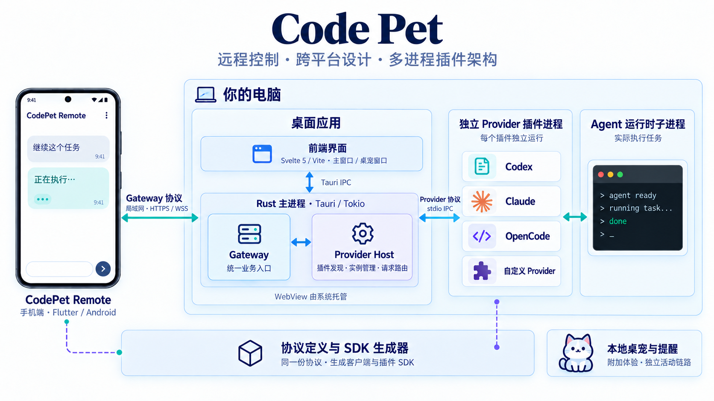

  

<h1 align="center">Code Pet</h1>

<strong>把电脑上的 AI Agent，带到你的手机上。</strong> 远程控制 · 统一会话入口 · Provider 插件扩展

  
  
  
  

  <a href="https://github.com/CodeKillerCoser/codepet/releases">电脑端下载</a> ·
  <a href="https://github.com/CodeKillerCoser/codepet-remote">远程客户端</a> · <a href="#快速上手">快速上手</a> ·
  <a href="knowledge/00-project/development.md">开发文档</a> ·
  <a href="https://github.com/CodeKillerCoser/codepet/issues">反馈问题</a>

## 让 AI 在电脑上执行，让你从手机上掌控

Code Pet 是一个以**远程控制和插件扩展**为核心的 AI Agent 平台。电脑端托管 Agent 接入，手机端通过 [CodePet Remote](https://github.com/CodeKillerCoser/codepet-remote) 查看项目、继续会话、接收实时输出，并在需要时处理审批或停止任务。

你可以从手机发起任务，让电脑上的 Agent 使用原有的项目和运行环境执行；也可以接着已有会话继续讨论，不必一直守在电脑前。当前远程连接以局域网为基础。

**接入新的 Agent，也不必重做远程端。** 开发者按 Provider 协议实现插件，交给 Host 加载，Remote 就能通过统一 Gateway 发现它，并使用插件声明的标准能力。

## 为什么做 Code Pet？

AI 编程工具越来越多，但任务和操作分散在不同的 CLI、应用和电脑上。离开电脑后，一次简单的追问、授权或进度确认，也可能需要回到原来的窗口。为每个工具分别开发手机端，又会重复处理连接、会话、消息和权限交互。

Code Pet 将这些共性集中起来：**Remote 提供统一操作入口，Host 管理连接与插件，Provider 对接具体工具。** 新工具沿用已有协议和界面，原有工具继续使用自己的 runtime。桌宠保留为本地提醒与个性化体验，是平台的一项附加能力。

## 你可以做什么？

| 场景 | 使用体验 |
| --- | --- |
| 离开工位，想继续推进任务 | 在已配对的手机上选择电脑与 Provider，创建或继续会话，发送下一条指令 |
| 想知道 Agent 正在做什么 | 查看流式回复、工具活动和历史消息，不必反复返回终端 |
| 任务需要你做决定 | 在 Provider 支持时处理审批、中断任务或调整当前输入 |
| 多个项目、多个 Agent 同时使用 | 从设备、Provider、项目和最近会话入口找到对应工作上下文 |
| 手机暂时断开连接 | 当前 Host 保留进行中的任务与待审批，待空闲后回收运行实例；电脑和 Host 仍需保持运行 |
| 想接入自己的工具 | 实现独立 Provider 插件，复用 Remote 的标准会话与控制界面 |

具体操作由 Provider 的能力声明和当前任务状态决定，不同 Agent 的历史范围、审批、停止和运行中调整能力可能不同。断线恢复不等于 Host 重启恢复，也不保证电脑睡眠后继续执行。

**继续 Codex 对话前，请留意会话锁。** Codex 对同一会话实行单一写入者机制：如果 Codex Desktop、CLI 或另一个 App Server 仍持有该会话，Remote 获取交互权时会遇到写锁冲突，不能直接接管。能看到历史不代表可以发送消息；需要让原持有方释放会话，再重试。任务完成、关闭 Remote 详情页或取消订阅都不保证立即释放锁。具体说明见 [Codex 会话锁与继续对话](knowledge/20-product/remote-control-and-plugins.md#codex-会话锁与继续对话)。

## 两个项目，一条完整链路

| 项目 | 安装在哪里 | 负责什么 |
| --- | --- | --- |
| **[Code Pet](https://github.com/CodeKillerCoser/codepet)**（本仓库） | 运行 AI 工具的电脑 | 设备配对、Gateway、Provider 插件管理、本机 runtime 接入，以及本地设置与桌宠 |
| **[CodePet Remote](https://github.com/CodeKillerCoser/codepet-remote)** | 手机，当前以 Android 为主 | 设备连接、项目与会话浏览、实时消息，以及按能力开放的任务操作 |

Remote 使用 Flutter / Dart，电脑端使用 Tauri 2 / Svelte 5 / Rust。任务在电脑上的 Agent runtime 中执行；手机通过 Gateway 发出操作并接收结果，无需直接接入每个 Agent 的原生接口。

## 插件优先：让更多 Agent 接进来

Provider 是可由开发者自行实现的**独立进程插件**。内置的 Codex、Claude 和 OpenCode 也走这套插件边界。

- **统一业务协议**：将工具能力映射为项目、会话、消息、任务和审批等标准对象与操作。
- **能力驱动界面**：插件声明支持什么，Remote 据此开放对应功能；不支持的操作明确不可用。
- **独立开发与加载**：manifest 描述插件和运行实例，Host 发现、启动并路由请求；插件无需依赖 Tauri 或桌宠代码。
- **配套 SDK**：协议 schema 与 manifest 是事实来源，随应用提供的 `cp-sdk-gen` 可生成匹配版本的 Provider SDK 和 Gateway SDK。

对于现有协议已覆盖的能力，完成 Provider 实现和安装后，就能复用现有 Remote，无需为该 Agent 定制客户端。若引入协议尚未表达的新能力，仍需扩展协议、生成 SDK，并补充相应客户端体验。

想接入自己的 Agent？从 [Provider SDK 与完整接入指南](tools/cp-sdk-gen/README.md) 开始：**生成 SDK → 实现 Provider → 声明能力与事件 → 安装插件 → 在 Remote 中验证**。目前生成器提供 Rust Provider server；Remote 的 Dart Gateway client 使用另一套生成目标。

## 内置接入

| Provider | 对接方式 | 说明 |
| --- | --- | --- |
| [Codex](crates/providers/codepet-provider-codex/README.md) | Codex App Server | 通过独立 Provider 提供远程会话与任务控制 |
| [Claude](crates/providers/codepet-provider-claude/README.md) | Claude CLI stream-json | 支持 Provider 管理的会话、发送和审批等；不宣称外部会话全量发现或运行中 steer |
| [OpenCode](crates/providers/codepet-provider-opencode/README.md) | OpenCode Server HTTP / SSE | 将原生会话、任务和事件映射到统一协议 |
| **你的 Provider** | 你选择的工具接口 | 实现兼容协议，在 Host 加载后向 Remote 暴露标准能力 |

安装包包含 Code Pet 的内置 Provider adapter，**不包含底层 Agent runtime**。请在电脑上自行安装、配置并完成对应工具的登录。第三方 Provider 的能力与兼容性由其实现决定。

## 快速上手

1. **准备电脑端**：从 [Code Pet Releases](https://github.com/CodeKillerCoser/codepet/releases) 获取系统对应的安装包；安装并配置要使用的 Codex、Claude 或 OpenCode。
2. **检查运行时**：启动 Code Pet，在 **连接 → 本机运行时** 查看 Provider 检测结果，必要时选择可执行文件，并检查连接状态。
3. **准备手机端**：按 [CodePet Remote 的安装与构建说明](https://github.com/CodeKillerCoser/codepet-remote#readme) 获取 Android APK，让手机与电脑处于可互通的局域网。
4. **配对设备**：在电脑端 **连接** 页添加设备，在 Remote 中发现 Host 并发起配对；核对两端显示的配对码，在电脑上确认。也可使用二维码配对入口。
5. **开始控制**：在 Remote 中选择电脑和 Provider，进入项目或会话，发送任务并查看实时输出。审批和其他操作按实际能力显示。

当前处于 **Beta** 阶段，建议搭配使用协议兼容的 Host / Remote 版本。电脑端发布流程覆盖 macOS 与 Windows，实际安装包以 Release 附件为准；Linux 需要自行构建验证，Remote 当前没有已验证的 iOS 工程。

当前主链路是 LAN HTTPS / WSS，具备设备配对、证书指纹校验和凭据撤销。公网中继、WebRTC 和跨设备文件传输仍属于后续设计方向。详细流程见 [远程控制与 Provider 扩展](knowledge/20-product/remote-control-and-plugins.md)。

## 简要架构

*架构示意图；图中的手机画面用于说明交互，不是实际产品截图。*

**Remote → Gateway → Provider Host → Provider → Agent runtime** 是主要控制链路。Gateway 为客户端提供统一业务入口，Provider 隔离各工具原生协议，SDK 让客户端与插件基于同一份协议开发。网络通道与业务协议分层，未来替换传输方式时可以保留业务契约。

更多实现细节见 [双端架构与扩展边界](knowledge/10-architecture/host-remote-platform.md) 和 [Remote 架构文档](https://github.com/CodeKillerCoser/codepet-remote/blob/main/docs/architecture.md)。

## 技术选型与架构设计

**跨平台是技术选型的核心因素。** 桌面端以 Tauri 和 Web 前端复用界面，Remote 以 Flutter 复用客户端业务与交互，Rust 承载共享 Host 和插件逻辑；窗口、进程、电源与网络等系统差异收敛到平台适配层。

Code Pet 采用**多进程架构**：Svelte 前端通过 Tauri IPC 调用 Rust 主进程中的 Gateway 与 Provider Host；每个 Provider 插件在独立进程中运行，再管理本机 Agent runtime 子进程。一个插件可以有多个实例，Server 模式的实例可服务多个会话。前端 WebView 由系统托管，与 Rust 主进程的职责分开。

| 技术选型 | 用在哪里 | 设计目的 |
| --- | --- | --- |
| Flutter / Dart | Remote 手机端 | 以共享代码组织跨平台客户端，将界面、用例和通信适配分层 |
| Tauri 2 / Svelte 5 / Vite | 桌面应用与配置界面 | 复用跨桌面平台的 Web 界面，通过 Tauri 接入原生系统能力 |
| Rust / Tokio | Host、Provider 与进程通信 | 共享跨平台核心逻辑，管理异步请求、插件生命周期、事件和有界并发 |
| JSON Schema / manifest / SDK 生成器 | 客户端与插件的共同契约 | 统一模型、方法和能力声明，减少两端协议漂移 |
| HTTPS / WSS + stdio IPC | Remote 网络连接与本机插件通信 | 网络接入与进程通信各自分层，共用明确的业务协议 |

**工具差异留在插件，通用能力留在协议。** Provider 独立进程便于故障隔离与生命周期管理；Gateway 隔离客户端与原生工具；Remote 按能力开放操作。插件进程隔离不等于权限沙箱，当前插件仍是受信任的本地程序。

跨平台设计不代表所有平台已经完成交付或能力完全相同：当前桌面发布覆盖 macOS / Windows，Remote 以 Android 为主，其他平台与系统专属功能的验证范围见上方上手说明。

## 电脑旁，也有一点陪伴

桌宠保留宠物图片、任务气泡和个性化设置，当前活动感知由 Provider 安装的 **Hook／原生插件**提供：Codex、Claude Code 使用 Hook，OpenCode 使用原生插件。任务状态经 Host 订阅分发到 Pet Gateway，展示执行、等待授权／输入和本轮结束等状态。

这套本地观察订阅与 Remote 控制链路独立，启用桌宠不会启动远程受控 runtime，也不会取得 Codex 会话写锁。当前桌宠列表只读，回复、停止和审批操作仍在 Remote 中按能力提供。旧私有 IPC 伴随方案已停用；接入说明见 [活动感知参考](knowledge/10-architecture/agent-integration-reference.md)。

## 参与建设

欢迎反馈远程控制体验、报告兼容性问题，也欢迎贡献符合非商业许可的 Provider 插件。提交问题时请附 Host / Remote 版本、系统、Provider 和复现步骤。

- [开发、测试与构建](knowledge/00-project/development.md)
- [Provider SDK 与接入教程](tools/cp-sdk-gen/README.md)
- [协议定义与生成](protocol/README.md)
- [Provider 用量查询与存储](knowledge/10-architecture/provider-usage-query-and-storage.md)
- [远程客户端源码](https://github.com/CodeKillerCoser/codepet-remote)
- [问题反馈](https://github.com/CodeKillerCoser/codepet/issues) · [排查文档](knowledge/40-runbooks/) · [开发规约](knowledge/60-rules/)

如果你也希望从手机上掌控自己的 AI 工作流，欢迎 Star、反馈，或接入下一个 Provider。

## 许可证：允许修改，禁止商用

本项目采用 [PolyForm Noncommercial License 1.0.0](LICENSE)，定位为 **源码可用（source-available）** 项目。

- **允许**：在许可允许的非商业用途下使用、学习、复制、修改和分发，包括修改后的版本。
- **不授予商业使用权**：出售、付费服务或用于商业业务等用途，需要另行取得相关权利人的商业授权。
- **分发时**：须附带许可证全文或其链接，并保留许可要求的通知；修改版本不因此自动获得商业使用权。
- 第三方依赖及已有独立许可的内容继续遵循各自许可证。

以上是便于阅读的摘要，具体许可目的（包括条款列明的非商业组织用途）、权利与义务以 [LICENSE](LICENSE) 英文原文为准。由于限制商业用途，本项目不属于 [OSI 定义的开源软件](https://opensource.org/osd)。
