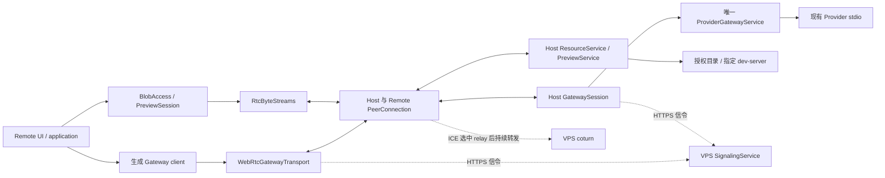
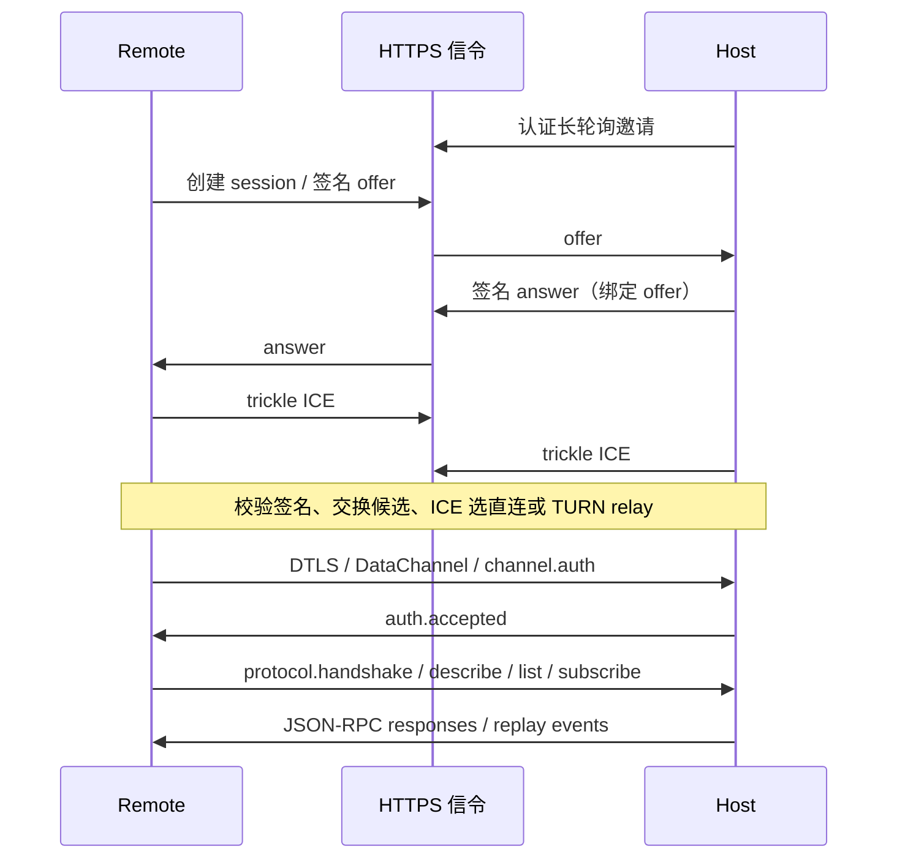

# Host / Remote 基于 WebRTC 的连接、请求与资源访问方案

> **2026-09-09 实施范围覆盖**：本轮新增 WebRTC 通道，保留现有 LAN HTTPS/WSS，暂缓全部文件挂载、传输与预览。以下“移除 WSS”“LAN 全部 RTC”“资源同期交付”是此前长期提案，不是当前实施任务。进度与验收以 [WebRTC 通道增量接入](../20-product/webrtc-channel-delivery.md) 为准。

## 背景

状态：**设计提案，未实施**。更新于 2026-09-08。本次只撰写方案，不安装依赖、不修改协议或业务代码、不部署 VPS、不变更 SSH 配置。

用户已确认：业务统一为 JSON-RPC over WebRTC DataChannel，目标态移除 Host↔Remote 业务 WSS；主要在中国大陆使用；先复用现有搬瓦工美国加州 VPS（AlmaLinux 9 x86_64、1 GiB RAM、20 GB 磁盘、周期流量额度 1000 GB，来源为用户面板，非压力测试）。yamux 可作为原生能力不足时的候选。公网 IP、SSH 及部署凭据不进入产品协议。

本文替代此前的最小接入讨论，并纳入 Remote 的 `docs/resource-uri-and-file-transfer.md`：文件导出、手机预览/下载/上传、静态页面挂载、开发服务器代理和 HMR。该文档同步修订为资源域详细方案；本文负责连接与跨仓库迁移闭环。

## 目标

1. LAN 与外网统一通过 WebRTC 传输业务，直连优先、TURN 兜底；信令使用 HTTPS，不要求 WSS。
2. 复用唯一 Host Gateway、Provider 实例及生成 SDK，保留现有请求、事件游标、身份和任务生命周期。
3. 文件字节使用独立数据通道，不塞进 JSON-RPC；手机可访问已授权目录、预览和保存文件、打开网页产物。
4. 旧配对可升级，网络变化、撤销、服务重启及写请求结果未知有明确行为。
5. 先测现有 VPS 与真实移动网络，再决定是否增加大陆中继。

## 非目标

- 本次没有实现、上线、真机验收或性能承诺。
- 不引入 SFU、音视频、通用 VPN、SMB/NFS/FUSE、云文件副本或公开网页托管。
- 第一阶段保留可信 LAN 首次配对；公网首次配对独立后续设计，不自动信任云端发现的设备。
- 不保证唤醒休眠电脑或手机永久后台在线，不承诺断线写请求 exactly-once。
- 在线预览面向明确注册的项目入口，不是任意 URL 开放代理，不保证所有第三方网站/SSO/Service Worker 透明运行。

## 现状理解与证据

### 已检查的快照和模块

| 范围 | 证据 | 结论 |
| --- | --- | --- |
| Host | 本工作树，commit `4e32b87fc26fbd3b40ef313f5c70ef93d6aa5097` | 初始仅本提案未跟踪，未发现其他改动 |
| Remote | `D:/17633/Documents/Code/codepet-remote`，commit `3f200650446d3752efcd9f4be6d1bbf10e58fb08` | 初始 status 为空；已检查真实源码；有 Android 工程，未见 iOS 工程 |
| Gateway | `protocol/gateway/v1/{manifest,schema}.json` | 当前 **21 方法、9 replayable event**，JSON-RPC 2.0，framing 为 `websocket-text` |
| Host 接入 | `crates/codepet-host/src/remote/channels/lan/listener.rs` | upgrade 前 bearer 校验；`run_gateway_socket` 混合帧、handshake、ping、订阅、调度、presence 和取消 |
| 凭据 | `remote/access.rs`、`remote/connections.rs` | Host 只保存 bearer hash；credential 绑定 clientId；每条连接独立登记 |
| 生成器 | `tools/protocol-codegen/generate.mjs`、Dart Gateway SDK | client 已传输无关，但 framing 白名单仍明确包含 websocket-text，不能只换 socket |
| Remote transport | `lib/gateway/{transport,pinned_web_socket_transport,gateway_client}.dart` | connect/request/events/close 契约；当前依赖 WSS、bearer header、text frame、15 秒普通 RPC 超时 |
| Remote runtime | `lib/application/sessions/device_session.dart`、`lib/discovery/resolving_gateway_transport.dart` | 已有 generation、缓存失效和重连；resolver/持久化仍围绕 Gateway URL |
| 配对/删除 | `lib/pairing/pairing_service.dart`、`lib/devices/device_registry.dart` | QR/数字确认后保存 credential；忘记设备先删本地，再 best-effort HTTPS revoke |
| 资源提案 | Remote `docs/resource-uri-and-file-transfer.md` | 已描述 codepet URI、registry、BlobAccess、static/dev-server 挂载，尚非实现 |
| 资源实现状态 | 检索 Remote lib/test/pubspec 和 Host Gateway | 未发现 BlobAccess、CodepetImageProvider、preview mount 实现；未引入 flutter_webrtc/inappwebview；文件方法不在当前 manifest |

已有知识中的“18 方法/10 事件”已落后于 manifest。Remote `docs/architecture.md` 中最后客户端离线即停止活动任务的描述也已过时；以 Host [离线执行](host-awake-and-offline-execution.md)和 [连接生命周期](remote-and-provider-connections.md)为准：有执行中请求、未结束 turn 或待审批时必须保留 Harness。本文不按旧描述重建错误行为。

### 保留的架构约束

- discovery 只提供候选定位；deviceId/clientId 不是凭据。
- admission 在 Gateway 前完成；业务 handler 不解析 bearer、证书、SDP 或网络帧。
- Host↔Provider 继续使用 stdio mux；不把 WebRTC 带进 Provider 业务层。
- 保留 routed resource 中的 Host/Provider/instance/project 身份，不能改成原生 ID 或 IP。
- Host 是资源唯一 mint/resolve 点；Remote 不解释 opaque token，不做 Markdown 全文路径替换。

## 实现路径

### 1. 目标拓扑和接口



一个逻辑客户端到一个 Host 使用一条 PeerConnection；多个 DataChannel 只登记一条 Remote presence，不能把文件流算成新的在线设备。

Host 拟议抽象为 `AdmittedPeer`、`GatewaySession`、`MessageChannel`、`DuplexByteStream`。GatewaySession 负责握手、心跳、订阅、caller scope、调度和释放；WebRTC adapter 负责 ICE/DTLS/SCTP、封装、背压和故障原因。可信身份由 AdmittedPeer 输入，不能由未认证消息自行填写。

Remote 保留 GatewayTransport 的 connect/request/events/close；增加可选连接诊断端口，文件端口放在 `application/ports`，domain 只含值对象。Tauri 组合后台 runtime，不把连接放进宠物窗口或 WebView 生命周期。

### 2. WebRTC 如何引入

| 端 | 候选与归属 | 进入实施的验证门槛 |
| --- | --- | --- |
| Rust Host | webrtc-rs/webrtc；`remote/channels/webrtc/`；对齐现有 Tokio | Windows/macOS 构建、DTLS 指纹绑定、TURN UDP/TCP/TLS、ICE restart、缓冲和 shutdown |
| Flutter Remote | flutter_webrtc；外层 `lib/channel/webrtc/` | Android 真机、DataChannel/低水位回调、candidate pair 统计、前后台恢复 |
| 手机网页 | flutter_inappwebview + 自有 loopback bridge | HTML/JS/CSS/fetch/WebSocket 实际请求探针，不能把静态 localhost 示例等同于完整代理 |

webrtc-rs 官方当前已有 runtime 抽象和新 API，不能直接照搬旧示例。P0 选择已发布版本、锁定依赖并保存互通结果；本文没有将未编译组合写成已验证版本。[webrtc-rs](https://github.com/webrtc-rs/webrtc)、[Flutter DataChannel](https://flutter-webrtc.org/docs/flutter-webrtc/api-docs/rtc-data-channel/)

只开启数据通道，不采集音视频、不申请摄像头/麦克风。平台网络权限与 WebView loopback 配置由各自基础设施 adapter 处理。

### 3. 通道、帧和背压

同一 PeerConnection 使用可靠、有序通道，不设置部分可靠的 maxRetransmits/lifetime：

| 通道 | 内容 | 开放时机 |
| --- | --- | --- |
| `cp.control.v1` | channel hello/auth/close、字节流窗口反馈；Gateway handshake/ping | Remote 固定作为 offerer 创建；准入前仅允许小尺寸 channel 消息 |
| `cp.rpc.v1` | 其余 JSON-RPC 请求/响应和全部 replay event | auth 成功后启用，事件保序 |
| `cp.bytes.v1/<streamId>` | 文件读写或预览交换的原始字节 | 授权 open 后按需创建；独立 FIN/reset/cancel |

Gateway 控制 lane 由 canonical manifest 生成 metadata 指定（初版 handshake/ping），adapter 不手写 method 表。channel auth/window/close 是 channel envelope，不能混入 Gateway method。event.subscribe 继续由共享 session 管理一次性订阅，Provider 调度逻辑仍用生成 dispatcher。

**JSON message binding：**UTF-8 JSON object 内容不变。新增 `codepet-rtc-message-v1` binary framing，固定 24 字节网络序头：

```text
magic[4]="CPG1" | version:u8=1 | flags:u8=0 | headerLength:u16=24
messageId:u32 | totalLength:u32 | offset:u32 | chunkLength:u32 | payload
```

messageId 仅在当前通道当前代有效，与 RPC id 分离。长度均为 UTF-8 byte 数；验证 offset、总长度、重叠、缺片、整数溢出和重组预算。发送方对一条消息连续发完各片，事件按统一 writer 顺序交付；control 位于另一通道，不进入大响应队列。ID 耗尽前重建通道，不能在未完成消息间复用。

以下是**待压测初值**，hello 协商取双方较小值；不是已验证容量：

| 项目 | 初值与约束 |
| --- | --- |
| 每个 DataChannel message | 含 header 最多 16 KiB，并受双方实际 SCTP max-message-size 约束 |
| Gateway request | 保留现入口 256 KiB 上限；control message 64 KiB，未认证消息另限 8 KiB |
| Gateway response/event | 解码前最多 16 MiB；不能把已有大历史能力降为单个 64 KiB 消息 |
| 重组 | 每 peer 总预算 32 MiB、最多 8 个未完成消息、30 秒超时；Host 另有全局总字节预算 |
| 普通请求调度 | 保留每 session 8 并发、队列 64、最多 32 session；补充队列字节预算 |
| 字节流 | 每 peer 最多 8 活动流，每流初始 credit 256 KiB、总接收预算 4 MiB |
| bulk 发送 | bufferedAmount 高水位 256 KiB、低水位 64 KiB；达到高水位即暂停读文件/上游 |

SCTP 已提供底层分片和流控；应用切块解决跨实现消息上限和内存预算。bufferedAmount 只是本端排队量，不是远端应用消费确认。字节流的最小 credit 反馈为 `streamId/generation/consumedOffset/receiveWindow`；只有下游消费或落盘才推进 consumedOffset，计数单调、不得超发。全局预算防止多个窗口相加超过设备承受能力。

多 DataChannel 共享 SCTP association 和拥塞控制，不承诺完全无队头阻塞。必须验证丢包、大历史、慢文件接收和 HMR 并发时 ping 时限；不达标先调整分块/窗口/并发，只有实测仍失败才评估独立数据 PeerConnection。

WSS 的 permessage-deflate 不直接继承。首版 RTC 用 identity 编码并分别记录 JSON bytes/传输 bytes；如后续压缩，显式协商 encoding、解压上限和两端实现。超限返回稳定 transport 错误，不截断正文，不伪装成 Provider 尺寸错误。

### 4. yamux 的采用条件

默认原生多 DataChannel，调用者只依赖 DuplexByteStream。yamux 可替换字节 adapter：

```text
BlobAccess / Preview → DuplexByteStream → yamux → 有界可靠有序 DataChannel
```

yamux 提供逻辑流窗口、半关闭和 reset，但仍需要底层 DataChannel 切块/背压，JSON 仍需消息 framing；单条有序底层仍有队头阻塞，规范没有全会话接收窗口。[yamux 规范](https://github.com/hashicorp/yamux/blob/master/spec.md)

采用门槛：可维护 Rust/Dart 实现或可接受 FFI 成本、窗口/关闭/互通测试通过、能降低整体实现量。当前未确认 Dart yamux，不能阻塞 Gateway MVP。若采用则替换原字节 adapter，不长期维护两套文件协议；信令/TURN 与业务 DTO 均不因此变化。

### 5. 身份、配对和已配对设备升级

明确选择：**在可信 LAN 配对/升级时绑定长期设备签名公钥，之后验证签名 SDP/ICE；原 bearer 继续承担 Host 准入。**不能把 LAN TLS fingerprint 当作临时 DTLS fingerprint，不能直接信任信令服务给出的公钥。

1. Host 持久 Ed25519 identity key，Remote 持久客户端签名 key；私钥进入本机安全存储，公钥按 deviceId/clientId/credentialId 绑定。Host 只有 bearer hash，不能假设可还原 bearer 来做共享密钥 HMAC。
2. 新配对保留 QR/数字确认与 pinned HTTPS，在 Host 接受后返回 RTC bootstrap。旧设备通过现有 TLS pin + bearer 调用拟议 `POST /remote/v1/channel-bootstrap`，绑定双方签名公钥，取得信令位置和独立信令兑换券。
3. Remote 原子提交新的 bootstrap；失败保留原设备与凭据。已配对设备若没取得新 key，则要求一次同 LAN 连接升级，不能从公网降低认证补信任。
4. 信令 envelope 签名覆盖 `version/from/to/sessionId/generation/sequence/expiresAt/kind/body`，固定 canonical 编码及跨语言测试向量。body 为完整 SDP 或 candidate/ufrag；Host answer 绑定 offer 摘要。固定 Remote offer、Host answer，避免双 offer。
5. 验证对端签名/代次/过期/重放后才接受 SDP，并由 WebRTC 栈校验其 fingerprint 与实际 DTLS 对端一致。完成后 Remote 经 control 发 `channel.auth`，包含 bearer/clientId/sessionId/nonce；Host 校验 credential 与签名身份及当前 session。
6. auth 成功才执行一次 Gateway handshake，clientId 必须与 admission 一致；Remote 复核返回 deviceId，Host 此时登记 presence。之前拒绝任何业务请求或大数据流。

私钥、业务 bearer 不进入信令服务、URL、普通日志或网页。信令 token 与 TURN credential 单独管理。设备 key 丢失/轮换通过可信 LAN 重新绑定，不允许云端无确认替换。旧 pin 保留给 LAN bootstrap/本地信令，不将其改名为 RTC key。

### 6. 信令服务如何开通和使用

自有轻量 HTTPS 服务与 coturn 独立进程。负责受限设备信箱、SDP/ICE 转送、会合状态与短期 TURN 凭据；不承载 Gateway payload、文件和对话。

**开通流程：**部署者把 signalBaseUrl 和一次性安装 enrollment token 配到 Host；服务验证并登记 Host 公钥，发 Host 信令凭据，消耗安装 token。Host 通过自身凭据登记已配对 Remote 的公钥，领取一次性兑换券，经可信 LAN bootstrap 交给 Remote。Remote 换取仅能访问该 Host/client 关系的信令 token。不依赖完整账号体系，也不允许凭 deviceId 抢注或匿名领取 TURN。

云端信令授权只能打开信箱，不能代替 Host 准入。即使云服务篡改消息，也无法伪造已 pin 的 peer 签名；但仍能拒绝服务并看到 IP/时序等连接元数据，不能宣称无元数据暴露。

拟议 API（独立 signaling schema，不放进 Gateway）：

| API | 用途 |
| --- | --- |
| `POST /signal/v1/enroll` | 单次安装授权登记 Host |
| `POST /signal/v1/clients`、`DELETE /signal/v1/clients/:id` | Host 登记/撤销自身 client，领取一次性兑换券 |
| `POST /signal/v1/token/exchange` | 单次券换 scoped signal token |
| `POST /signal/v1/sessions` | 创建会合，clientAttemptId 幂等 |
| `POST /signal/v1/sessions/:id/messages` | 签名 offer/answer/candidate/end-of-candidates/reject/close |
| `GET /signal/v1/inbox?after=...&wait=25` | 有界长轮询，消息 ID 去重及确认 |
| `POST /signal/v1/ice-credentials` | 签发限时 coturn username/password/URLs |
| `DELETE /signal/v1/sessions/:id` | 清理会合；不等于关闭 Provider 任务 |

Host 常驻长轮询接邀请；Remote 在连接/恢复时监听。25 秒到期或有消息即返回，失败加抖动退避。candidate 先于 remote description 时有界缓存，按 generation+ufrag 隔离。初始 TTL 2 分钟、SDP 128 KiB、candidate 8 KiB、每代最多 128 个候选，均需测试；消息过期不代表已建 PC 应关闭。

持久身份、公钥和 token hash 可放 SQLite；短时消息有界且过期删除，服务重启令未完成会合重试，不恢复半截 SDP。限流按安装/Host/client/IP，多层限额避免耗尽 VPS。

TURN 签发 secret 仅服务端持有，短期凭据经 HTTPS 发给有权建立该连接的两端。长会话在到期前获取新凭据并受控更新 ICE；实际 allocation refresh/SDK 更新行为是 P0 必测项，不能假设 TTL 过期不影响活跃中继。

**同 LAN 断公网：**保留 mDNS + pinned HTTPS 本地 signaling adapter，使用同样签名 envelope/admission；不访问 VPS 也能重新建立 LAN DataChannel。先短暂尝试本地候选，不通再走云；每次只接受一个 active session，晚到分支关闭。局域网方案不依赖云端 TURN 发放，不把 mDNS 失败视为身份变化。

### 7. 建连和连接生命周期



拆开 `signalStatus`、`peerStatus`、`gatewayStatus` 和 `pathKind`。只有 auth/handshake 成功才是业务在线；只按实际 selected candidate pair 判断 direct/relay，配置了 TURN 不等于使用 TURN。

- 保留 20 秒应用 ping、10 秒 ping 超时、60 秒无有效 pong 离线；普通 RPC 初始仍为 15 秒。建连/协商预算独立，不用普通 RPC 超时限制 TURN 建连。
- 只停信令，已稳定的 DataChannel 可继续；新连接和需要信令的恢复受影响。只停 coturn，使用其 relay 的路径受影响；整台 VPS 故障分开报告两者。
- ICE disconnected 先有界恢复观察；网络变化进行 ICE restart。若 SCTP/DataChannel 持续存活可保留 Gateway session；PC/channel 已关闭则新 generation，重新 auth/handshake/subscribe。
- 保留 DeviceSession generation fencing；旧响应不能完成新请求。重连按现有约束清空失效缓存、重建快照/event window，不把内存缓存写成持久重放保证。
- credential revoke 先持久化，再取消该 credential 的所有 PC、resource lease、下载/上传/预览；云端解绑异步重试，不阻塞 Host 拒绝。新连接登记后再次复核撤销，覆盖竞态。
- Remote 忘记设备保留“先删本地，后 best-effort revoke”，但先捕获短期 revocation context；可连时经 channel 管理消息 revoke，不能继续从旧 WSS URI 拼 DELETE。无法确认时提示在 Host 列表确认移除。
- 取消文件只关闭文件流，不映射成 turn.interrupt。最后客户端离线保留活动请求/turn/审批；Host 真正退出仍有界清理。

### 8. WSS 和 LAN REST 迁移

| 当前入口/行为 | 目标 | 要保留/迁移的语义 |
| --- | --- | --- |
| `/remote/v1/gateway` WSS | DataChannel auth → GatewaySession | 删除 header/text frame/Close code 依赖，领域错误不变 |
| PinnedWebSocketGatewayTransport / resolver | RTC transport + local/cloud signaling resolver | 设备 key pin、候选验证；ICE candidate 不持久化为 Host endpoint |
| `/remote/v1/discovery`、mDNS | 本地 signaling 候选 | 保留 LAN 离线建连能力，发现不是认证 |
| `/remote/v1/pairings/:id/exchange` | 原 pinned HTTPS + bootstrap | pairingSecret 不进 SDP/云/Gateway |
| pairing-requests create/status | 保留数字确认并返回已确认 bootstrap | Host 接受前不发业务 bearer 或 signal 兑换券 |
| `/remote/v1/credentials/current` DELETE | channel 管理 revoke；迁移期保留 LAN HTTPS | 先持久化再尽力 ack/关闭；丢 ack 不撤销已成功的 revoke |
| WebSocket Ping/Pong | 不保留该原生帧 | 保留 protocol.ping；ICE consent 不替代业务心跳 |
| permessage-deflate | identity 编码起步 | 调整指标，后续压缩须协商 |
| WebSocket session registry | peer/session registry | 多 channel 一条 presence，按 credential 批量关闭 |
| WebSocket Close code | channel close reason + 应用 failure | auth_failed/revoked/protocol_error/overloaded/shutdown/timeout |

Gateway manifest framing 改为 `codepet-rtc-message-v1`；新增 `protocol/channel/webrtc/v1` 管理 hello/auth/close/stream 控制与 binding，不复制 Gateway DTO。生成器 framing whitelist、control lane metadata、fixtures、Rust/Dart 导出、App bundle SDK 和 Remote vendored SDK 同步更新。新字段/帧影响严格解码，必须同批发布。

Remote PairedDevice 增加 bootstrapVersion、peerSigningKeyRef/公钥、signal locator/token ref 等传输 metadata，保留稳定 deviceId/clientId/业务 credentialKeyRef/alias。preferredEndpoint 和 endpointHints 迁移为 LAN signaling hints，不再接受持久 WSS 为生产业务路径；secure storage 与普通 metadata 原子提交、失败回滚，不删除旧数据来逼用户重配。

旧 WSS 仅在开发阶段用于行为比较；目标提交删除生产路由、依赖及 factory 分支，不保留自动业务回退。老 Remote/Host 明确要求配套升级。回滚需要成对版本和非破坏 metadata 备份，不能只回滚一端并声称兼容。

### 9. 当前 21 个 Gateway 请求逐项迁移

现有 params/result/error/meta 保留；JSON-RPC request ID 由 RTC adapter 关联。发送完成只代表传输提交，不代表业务成功。以下恢复由应用用例决定，transport 不自动重放。

| 方法 | 保留语义 | 断线/超时处理 |
| --- | --- | --- |
| `protocol.handshake` | 每 peer 成功一次；clientId 对准入身份 | 新 peer 重做，同 peer 重复拒绝 |
| `protocol.ping` | 单调 sequence，Provider 摘要不推进 cursor | control lane，旧代 pong 丢弃 |
| `protocol.describe` | 协议与能力元数据 | 可重读 |
| `event.subscribe` | snapshotCursor 边界、一次订阅、replay 顺序 | 新 session 重建；cursor 无效重取快照 |
| `provider.list` | 多实例身份/状态 | 新 generation 重读 |
| `provider.describe` | 完整 capability/revision | revision 变更重读，不用空摘要判不支持 |
| `project.list` | route、分页、snapshotCursor | 重读当前页，不自动遍历全部 |
| `project.get` | 精确 routed project | 可重读 |
| `project.create` | manifest idempotent 的原约束 | 先查状态，不由 transport 无限重发 |
| `project.update` | patch/route/capability | 先读最新状态再决定重复意图 |
| `project.delete` | 既有删除语义 | 先确认已删除状态 |
| `conversation.list` | provider/project、分页/快照边界 | 新 runtime 重取当前范围 |
| `conversation.search` | 查询/分页 generation | 旧查询丢弃，必要时重查 |
| `conversation.get` | 完整当前页、snapshotCursor/pageInfo | 保留 provider_response_too_large 的 20→10→5→1；transport 错误不截断历史 |
| `conversation.markRead` | 已读状态 | 用例合并最新意图，旧代不能回写 |
| `conversation.acquireInteraction` | 获取交互权，无定时续租 | 失效后重取，不绑定文件流 |
| `conversation.resume` | acquisition 与 history 结果分离 | 历史失败只重取历史，不重复成功 acquisition |
| `conversation.create` | **nonIdempotent** | 结果未知先查列表，禁止自动再创建 |
| `turn.send` | **nonIdempotent**；userItem 可空；best-effort 去重 | 结果未知先查会话/live state，不承诺 exactly-once |
| `turn.interrupt` | 原目标 turn/状态约束 | 先看是否终态，不能重放到新 turn |
| `approval.resolve` | 当前审批和 generation | 先看是否已解决，不能把旧决定套新审批 |

caller scope 保持认证逻辑 client 的稳定命名空间，不能换成 PC ID、signal sessionId 或 IP；否则重连会破坏现有 turn.send 缓存去重。clientRequestId 不因传输换代偷偷重建。详见 [受理规约](../60-rules/gateway-turn-send-admission.md)。

9 个事件全部复用：`project.changed`、`provider.changed`、`conversation.upserted`、`conversation.itemUpserted`、`conversation.activityChanged`、`turn.upserted`、`turn.outputDelta`、`approval.requested`、`approval.resolved`。文件进度/ICE 状态不冒充 Gateway replay event；保留范围外的 cursor 按原错误和快照恢复，不补造历史。

### 10. 文件挂载、预览、下载与上传

资源细节以 Remote `docs/resource-uri-and-file-transfer.md` 为同版配套设计：

- “挂载”是 Host 注册可导出的项目/产物目录或指定 dev-server，不是任意访问整盘。默认只读，上传另授权。
- 保留 `codepet://<deviceId>/content/<relpath>` 和 `/encrypt/<token>`。path relpath 的首段明确为稳定 mountId，消除多项目同名路径；encrypt 是历史路由名，token 不代表密码学加密，也不免鉴权。
- Host 唯一 mint/resolve。Provider 声明结构化候选资源，由 Host 校验创建引用；Remote Markdown hook 遇到路径请求 Host resolve，不自行创造 token。
- JSON-RPC 只传 URI/元数据/范围/ticket。字节走 RtcBlobAccess，不新增跨设备 HTTPS 文件服务，不经信令转发正文。
- 图片、受限文本/Markdown、PDF 分级预览；不支持格式提供下载/系统打开。HTML 使用隔离 preview session，不在聊天渲染器直接执行。
- 下载绑定版本/范围，分块落盘到 .part，校验后原子完成；版本变化拒绝旧续传。支持超过内存的文件，仍受磁盘/配额限制。
- 上传取得 write grant，临时写入后 digest/冲突校验并显式 commit；默认不覆盖，不执行上传内容。取消/TTL/撤销清临时文件。

拟议新增 Gateway 方法，须在 canonical schema 生成，不能伪装成现有 Provider 方法：

| 方法 | 用途 |
| --- | --- |
| `resource.resolve` | 路径/URI + route context → Host 验证后的 canonical URI |
| `resource.stat` / `resource.list` | 元数据/允许动作、授权 mount 分页目录；list 无 parent 时仅列当前 client 可见的导出根 |
| `resource.openRead` | expectedVersion、offset/length → session-bound read ticket |
| `resource.openWrite` | write grant、目标、大小 → 临时上传 ticket |
| `resource.commitWrite` | uploadId/digest/冲突条件 → 原子提交后的引用 |
| `resource.cancel` | 幂等取消资源 lease，不干扰 AI turn |
| `preview.open` / `preview.close` | 已注册 preview URI → 有限期 preview session / 关闭 |

这些是新能力，当前 21 方法中不存在；由 Host 广告 resource/preview capability，不等于 Provider project capability。ticket 绑定 credential/client/peer generation/resource version/operation/range/TTL，不能变成任意文件访问令牌。Host mount/注册工具仅在本机/已授权 Harness 上提供，不给 Remote 一个任意导出整盘的 RPC。

### 11. 在线网页预览怎样工作

WebView 不会自动通过 DataChannel 加载 codepet URI 和所有子资源。使用原生 loopback HTTP/WebSocket bridge：

```text
WebView http://127.0.0.1:<每个预览独立端口>/
  → Remote loopback bridge（当前 preview session 授权）
  → RTC 预览请求元数据 + 独立 body / 双向流
  → Host PreviewService
  → 授权静态目录 或 固定 Host loopback dev-server
```

每个预览隔离 origin/端口，listener 只 bind loopback。随机启动能力建立短期本地会话，校验 Host/Origin；不能仅凭随机端口放行。cookie 不按端口隔离，必须使用独立 WebView 数据存储或受控隔离机制；平台不支持时首版仅允许一个活动预览并在切换时清理，不能假设不同端口天然隔离 cookies。网页得不到 Host bearer 或通用 native bridge，关闭预览清理状态。

静态模式支持 GET/HEAD、相对/根路径、MIME、Range/ETag；SPA fallback 仅显式启用且请求 HTML 时生效。动态模式支持受限 HTTP 方法、流式 body、指定 dev-server 的 WebSocket upgrade；明确 query/status/headers/redirect/cookie 映射，禁止通用 CONNECT 和任意上游 URL。

HMR 路径为 `WebView WS → Remote bridge → RTC duplex stream → Host bridge → dev-server WS`。这是被预览应用的 WebSocket 语义，**不是保留 Host↔Remote 业务 WSS**。Vite 等 dev-server 需要挂载时配置 HMR public origin 或已验证 adapter；不能只替换 HTML 全文就声称支持所有绝对资源/HMR。不支持实时更新时明确提示并提供静态预览。

私有 localhost 链接只解析到注册目标，不能把 Host 127.0.0.1 当手机同名地址。普通外链通过明确用户动作访问，不透明转发 Host 权限。默认限制网页外部网络/导航；扩大权限需要显式 preview policy。

Android 平台推荐 HTTP(S) origin 处理 WebView 本地内容；插件 localhost 示例只证明静态资产可服务，通用 HTTP/WS bridge、权限、流式请求及 Service Worker 隔离仍需真实探针。[Android 文档](https://developer.android.com/develop/ui/views/layout/webapps/load-local-content)、[InAppWebView](https://inappwebview.dev/docs/in-app-localhost-server/)

### 12. VPS 和运维设计

首轮复用现有美国加州 VPS，不新购。轻量 HTTPS 信令 + coturn + systemd，身份元数据用 SQLite；无需 Redis/SFU/数据库集群。AlmaLinux 9 的 CRB/EPEL 可提供 coturn；实际包路径、服务名和版本在部署时核对，本次不执行安装。

| 配置 | 计划 |
| --- | --- |
| DNS | 使用可迁移域名；IP 变化只改定位，不改已配对身份 |
| 入口 | HTTPS 443；STUN/TURN 3478 UDP/TCP；TURN/TLS 5349 |
| relay 端口 | 例如 49160–49259 UDP 起步，coturn/防火墙一致，按分配数扩展 |
| TLS 443 兜底 | 与信令同 IP 不能直接抢占；另 IP/实例或验证后的四层分流，不靠不同域名解决 |
| TURN 准入 | 临时 credential、配额/带宽限制、私网/回环目标拒绝；secret 仅服务端 |
| 网络 | 验证公网地址/UDP，不关闭 SELinux 或防火墙掩盖错误 |
| 运维 | 独立进程重启、证书续期、流量/磁盘/分配数告警、脱敏日志 |

信令不在已建立业务数据路径上。直连时大陆设备不经加州转发；relay 时延迟/吞吐受跨境线路影响。1000 GB 面板额度不是有效文件容量承诺，服务商收发统计和其他业务用量需确认。

记录连接阶段耗时（signal/ICE/DTLS/auth/Gateway）、selected candidate type/relay transport、ping RTT、断线原因、重连次数、缓冲峰值、资源流量。只记录必要诊断，不记录 bearer/SDP 正文/文件内容/opaque token。UI 显示直连/中继及失败动作，不能展示实现细节替代用户可理解状态。[coturn](https://github.com/coturn/coturn)、[AlmaLinux 仓库](https://wiki.almalinux.org/repos/Extras)、[EPEL 包](https://packages.fedoraproject.org/pkgs/coturn/coturn/epel-9.html)

### 13. 实施阶段与完成条件

| 阶段 | 内容 | 退出条件 |
| --- | --- | --- |
| P0 互通 | 锁库版本、signed SDP、消息/字节缓冲、直连/TURN UDP/TCP/TLS | 两端真机 ping/大消息通过，缺失能力有明确替代 |
| P1 基础连接 | HTTPS/LAN signaling、bootstrap、GatewaySession、RTC adapter | 21 方法/9 事件、撤销/多端/离线活动保留和升级通过 |
| P2 WSS 切换 | 生成器/SDK/bundle、工厂/metadata，移除生产 WSS | 无业务 WSS 回退，旧端明确提示升级，成对回滚方案 |
| P3 文件闭环 | mount/registry、资源 RPC、读取、图片/文本/PDF/下载 | 超内存文件落盘，范围续传、越权/路径测试通过 |
| P4 在线预览 | 静态 bridge、SPA/子资源、dev-server HTTP/WS/HMR | 子资源与实时更新完整，跨项目 origin 隔离 |
| P5 上传与扩展 | write grant、临时文件/commit/续传；必要时 yamux | 冲突/取消/重启结果明确，没有半文件发布 |
| P6 公网首次配对 | OOB 身份、邀请/双方确认、反滥用 | 独立设计，不能用信令账号绕过 Host 接受 |

P0/P1 不被 WebView 插件风险阻塞；P3–P5 已包含在完整需求范围内，不能把连通视为全部完成。工期在互通探针后细化，不承诺未经验证的完成天数。

## 涉及模块

| 模块 | 原因 / 拟议变化 |
| --- | --- |
| Host remote/channels/lan/listener.rs | 提取 session、保留 LAN admission，删除 WSS upgrade/framing |
| Host remote/channels/webrtc/（新增） | PC、消息/字节 adapter、ICE/DTLS/关闭 |
| Host remote/session.rs、remote/signaling/（新增） | 统一会话及 LAN/cloud 会合，不向业务散落网络判断 |
| Host remote/access.rs、remote/connections.rs | key/bootstrap、凭据撤销和单 peer presence |
| Host resources/、previews/（新增） | 导出根、registry、文件 lease、限定 dev-server，不挤进 Provider handler |
| Host gateway.rs | 保留原方法，新增 typed resource/preview service 注入 |
| Tauri runtime / frontend | 后台连接、服务设置、导出授权、撤销、诊断，独立于窗口 |
| Provider SDK/runtime 集成点 | Harness 暴露受限资源注册工具，Provider 仅声明候选，不替换 stdio |
| protocol / generator / SDK / bundle | RTC binding、lane、资源 DTO、独立导出 freshness |
| Remote gateway/channel/discovery | RTC transport、events/failure、local/cloud locator |
| Remote pairing/devices/security | bootstrap、密钥存储、原子 metadata 迁移 |
| Remote application/core | 保持 generation/cache；资源值对象和用例/端口 |
| Remote features/app | 图片/文件动作、下载状态、WebView composition，不直接持有凭据 |
| 独立 signaling service | scoped 信箱与 TURN 签发，可独立运维 |

新增路径仅表达责任归属；实施时核对模块公开 re-export 和测试依赖，本次未创建代码空壳。

## 风险

| 风险 | 验证与缓解 |
| --- | --- |
| SDP/ICE 替换与身份混淆 | 签名向量、错误 key/deviceId/offer hash/ufrag、过期重放、实际 DTLS mismatch 拒绝 bearer |
| 旧设备升级降低信任 | LAN pin/bearer、原子保存失败、key 轮换/重装/旧端测试 |
| 大消息/文件撑爆内存或阻塞 ping | framing 边界、慢消费者、全局预算、大历史/预览并发压测 |
| 网络重连重复写 | 每种 mutation 的 unknown outcome、Host 重启/缓存淘汰、stable caller scope |
| 路径逃逸/SSRF | Windows junction/symlink/TOCTOU、跨 mount/token scope、任意端口/URL 拒绝 |
| 预览获得 Host 全权限 | local origin/cookie 认证、无 bearer/native bridge、跨站/重定向/WS 测试 |
| 仅首个 HTML 能加载 | CSS/module/fetch/Range/SPA/WS/HMR 真机探针 |
| VPS/跨境线路不稳定 | 信令/TURN/整机独立故障注入，三网直连/中继样本 |
| TURN 滥用/到期 | 签发限额、private target 拒绝、长会话 refresh/ICE 更新 |
| presence/离线任务退化 | 两手机、多 channel、一端撤销、最后离线活动保留、退出回收 |
| 跨平台依赖失败 | Windows/macOS/Android 原生构建；iOS 不列已验证 |

## 测试计划

自动化首先覆盖共享 session/transport contract，再做跨网验收：

- framing：空/边界、16 KiB 分片、256 KiB request、16 MiB response、错版本/长度/offset、重组超时/预算/id 代次。
- signaling/admission：token scope、nonce/TTL/重放、候选乱序、重复 offer、撤销竞态、signal 离线不关闭健康 PC。
- Gateway：参数化复用 remote_lan_listener 的业务断言；pending get 期间 ping、并发/队列、订阅游标、不同 caller 同 clientRequestId 隔离。
- Remote：transport/resolver/pairing/registry/DeviceSession/Gateway client/layering；关闭后 pending future 完成失败，旧响应不落新代。
- resource/preview：安全路径、版本/Range/digest、上传提交、续传、磁盘/内存预算、取消/撤销/TTL、HTTP/WS/HMR；详见 Remote 配套文档。

实施时执行（**本次未运行**）：

```text
# Host
npm run protocol:check
npm run sdkgen:test
cargo test --manifest-path crates/Cargo.toml -p codepet-host --test remote_lan_listener
cargo test --manifest-path crates/Cargo.toml -p codepet-host --test manager_gateway
cargo test --manifest-path crates/Cargo.toml -p codepet-host --test builtin_provider_integration
cargo test --manifest-path sdk/rust/Cargo.toml -p codepet-gateway-sdk
cargo check --manifest-path src-tauri/Cargo.toml
# 新 RTC/resource target 按实际实现补入，不宣称当前已存在
# Remote
flutter analyze
flutter test
flutter build apk --debug
```

| 真机场景 | 验收点 |
| --- | --- |
| 同 LAN、无公网 | 本地信令重新建连，业务仍 RTC |
| 移动/联通/电信、蜂窝↔宽带 | selected pair、直连率、p50/p95 建连耗时和 RTT |
| 强制 relay、禁 UDP | TURN UDP/TCP/TLS，端口限制可诊断 |
| Wi-Fi↔蜂窝、锁屏/前后台 | 有界恢复、旧 generation 丢弃、任务不重复发送 |
| 大历史 + 大文件 + 网页 | ping 时限、动作可用、内存随窗口而非文件大小增长 |
| HTML/SPA/HMR | 子资源/fetch/WS、关闭与返回、origin/storage 隔离 |
| 撤销/Host 退出/VPS 重启 | 资源及时关闭、无半文件、故障分类正确 |
| 窄屏/横屏/键盘 | 预览/保存/取消可见，焦点和滚动正常 |

## 知识沉淀与本次验证

本次重写本提案，同步 Remote `docs/resource-uri-and-file-transfer.md`，按职责互引，不新增中心知识映射。现有架构事实页在实现验收后再更新，避免把提案伪装为已经发生的迁移。

已完成源码/附近测试/协议/文档只读检查与官方资料核对。交付前执行两仓库 git diff --check、文档链接及方法覆盖检查；实际结果随交付报告。没有运行产品测试、构建、网络探针或部署。

## 未知项

- Rust/Flutter 最终版本的互通、TURN/TLS、ICE restart；Dart yamux 可维护性。
- 公网首次配对是否进入首发；当前第一阶段明确需要可信 LAN bootstrap。
- 域名/证书、并发/流量规模、套餐统计口径和三网质量；本次未远程检查 VPS。
- WebView bridge/HMR 插件适配、PDF 渲染库、后台下载策略；iOS 工程未有证据。
- 不同 Harness 的注册工具注入能力、上传授权交互和敏感目录策略；Agent 声明不等于用户授权。

## 外部资料

查阅日期 2026-09-08；官方能力说明不等于本项目验收结果。

- [WebRTC signaling](https://webrtc.org/getting-started/peer-connections)
- [DataChannel 消息尺寸和缓冲](https://developer.mozilla.org/en-US/docs/Web/API/WebRTC_API/Using_data_channels)
- [webrtc-rs](https://github.com/webrtc-rs/webrtc)、[Flutter API](https://flutter-webrtc.org/docs/flutter-webrtc/api-docs/rtc-data-channel/)
- [yamux](https://github.com/hashicorp/yamux/blob/master/spec.md)
- [coturn 配置](https://github.com/coturn/coturn/blob/master/examples/etc/turnserver.conf)
- [Android 本地内容](https://developer.android.com/develop/ui/views/layout/webapps/load-local-content)、[InAppWebView localhost](https://inappwebview.dev/docs/in-app-localhost-server/)
