# CodePet AI 会话任务谱系技术设计

> 文档状态：方案设计稿
>
> 目标阶段：本地单机 MVP → 多平台扩展
>
> 首期数据源：Codex
>
> 后续数据源：Qoder、OpenCode 等
>
> 持久化方式：本地 JSON 文件，不引入数据库
> 当前状态：2026-09-10 首期分支实现已落地，尚未合并发布；本文仍包含后续目标，实际范围与验证见 [首期交付记录](../40-runbooks/task-lineage-v1-delivery.md)。
> 抽取输入：仅最近 48 小时的用户消息与 AI 正文，不包含工具执行、委派工具正文或 reasoning；细则见 [输入规约](../60-rules/task-lineage-extraction-input.md)。

## 1. 背景

Codex、Qoder 等 AI 编程工具以 Thread/会话作为主要工作载体，但真实工作并不严格等同于会话：

- 一个主对话可能派生出 Fork、新对话或 Subagent。
- 一个任务可能在多个 Thread 中并行推进，随后回到主 Thread 汇总。
- 一个 Thread 可能先后处理多个可以独立验收的任务。
- 同一个任务可能多次返回同一个 Thread 继续处理。
- Thread 结束并不代表任务已经完成，只代表当前执行上下文停止。
- worktree 中的代码可能已提交但尚未同步到主工作区。

CodePet 需要以原始对话记录为一手事实，在不修改 Codex/Qoder 的情况下，建立：

1. Project 下的主对话与派生对话树。
2. Thread 与 Task 的双向关联。
3. Task 跨 Thread 的执行节点和流转图。
4. Task、Thread、代码提交与主工作区同步状态。
5. 从任务图直接返回对应原始对话并继续发送消息的闭环。

## 2. 目标与非目标

### 2.1 目标

- 增量发现新增或变化的 Project、Thread 和 Transcript。
- 屏蔽 Codex、Qoder 等平台的数据格式差异。
- 从标准化事件中抽取 Task 和 Execution Episode。
- 保存每个抽取结论对应的原始证据。
- 支持对话树、任务图、时间泳道和消息流查询。
- 使用 JSON 文件完成本地持久化、恢复、幂等和版本迁移。
- 抽取执行器可配置为 Codex、OpenCode、远程 Assistant 或其他工具。
- Git 状态必须由真实工作区核验，而不是只相信对话文本。

### 2.2 非目标

- 首期不实现多人协作和远程共享数据库。
- 首期不追求跨设备实时同步。
- 不自动把任务标记为“已完成”。
- 不推断“实现线程”“测试线程”“负责人”“优先级”等无法可靠核验的信息。
- 不给流转边推断“派发”“驳回”“验收失败”等业务语义。
- 不把每条消息或每个工具调用都生成一个任务节点。
- 不要求修改 Codex 或 Qoder 自身实现。

## 3. 核心设计原则

### 3.1 原始记录是一手事实

平台 Transcript、Session 元数据和 Git 仓库是事实来源。Task、Episode、摘要和任务图均为可重新生成的派生数据。

### 3.2 平台差异在入口层消化

AI 抽取器只接收统一事件，不直接处理 Codex JSONL、Qoder SQLite 或其他平台原始格式。

### 3.3 确定性事实优先于模型推断

Thread ID、创建方式、父子关系、工作目录、分支、提交和运行状态优先通过结构化数据和规则获取。AI 只处理任务边界、任务归属和执行摘要等语义问题。

### 3.4 Task 与 Thread 是多对多关系

不能在 Task 上只保存一个 `threadId`，也不能默认一个 Thread 只有一个 Task。

### 3.5 Task 和执行节点分层

- Task：可以被用户独立验收、重新打开或标记完成的工作结果。
- Execution Episode：某个 Task 在某个 Thread 中的一段连续执行过程，也是任务图节点。
- Message/Event：支持 Task 和 Episode 判断的原始证据。

### 3.6 JSON 存储通过 Repository 隔离

业务层不能散落 `readFile`、`writeFile`。所有读写都通过存储接口，当前实现为 JSON Repository，以后可替换为 SQLite 或远程服务。

## 4. 系统上下文架构

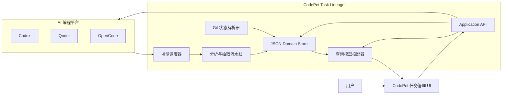

## 5. 三层业务架构

系统分为三层，并由统一领域模型、JSON 存储和可观测性作为横向基础设施贯穿。

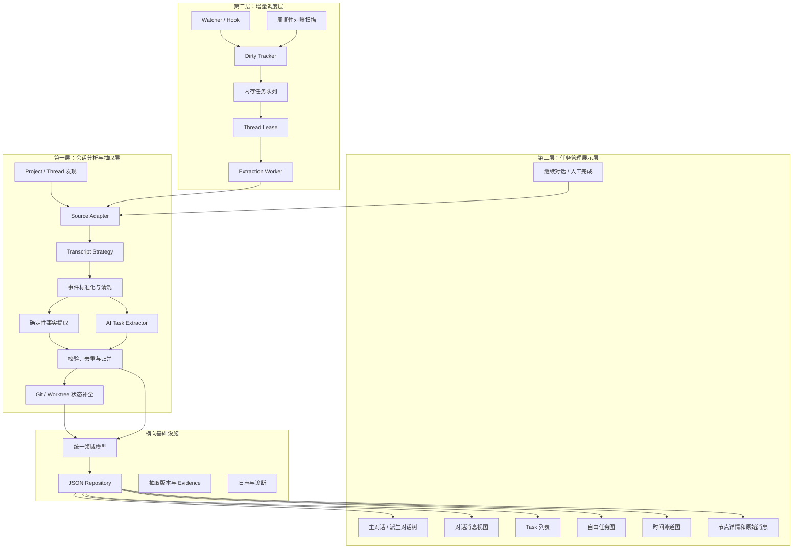

## 6. 模块职责

### 6.1 Source Adapter

每个平台实现统一的会话数据接口。

```ts
interface ConversationSourceAdapter {
  readonly platform: string;
  readonly capabilities: SourceCapabilities;

  discoverProjects(): Promise<SourceProject[]>;

  discoverThreads(
    project: SourceProject,
    cursor?: DiscoveryCursor,
  ): Promise<ThreadDiscoveryResult>;

  getThreadMetadata(threadId: string): Promise<SourceThread>;

  readEvents(
    threadId: string,
    cursor?: SourceCursor,
  ): Promise<SourceEventBatch>;

  getThreadRuntime(threadId: string): Promise<ThreadRuntimeState>;

  sendMessage?(
    threadId: string,
    message: string,
  ): Promise<SendMessageResult>;
}
```

能力声明：

```ts
interface SourceCapabilities {
  supportsStableEventId: boolean;
  supportsRuntimeStatus: boolean;
  supportsLineage: boolean;
  supportsSendMessage: boolean;
  supportsWorktreeMetadata: boolean;
}
```

首期实现 `CodexAdapter`，后续增加 `QoderAdapter` 时不修改 Task、Episode、调度器和前端领域模型。

### 6.2 Transcript Strategy

同一平台可能存在多个数据版本，解析策略应独立于 Adapter：

```ts
interface TranscriptStrategy {
  canHandle(metadata: TranscriptMetadata): boolean;

  decode(rawRecord: unknown): DecodedRecord[];

  normalize(
    record: DecodedRecord,
    context: NormalizationContext,
  ): CanonicalEvent[];

  createCursor(record: DecodedRecord): SourceCursor;
}
```

可能的实现：

```text
CodexJsonlStrategyV1
CodexSqliteStrategyV2
QoderSessionStrategyV1
OpenCodeEventStrategyV1
```

### 6.3 确定性 Fact Extractor

以下信息不交给 AI：

- Project、Thread 和原始 Event ID。
- Human/AI 创建。
- 主对话、Fork、新对话、Subagent。
- 父子 Thread 和 Root Thread。
- Thread 启动、停止和最后活动时间。
- 工作目录、worktree、分支和 commit hash。
- 工具名称和工具调用结果。
- 原始消息定位。

```ts
interface FactExtractor {
  extract(
    events: CanonicalEvent[],
    context: FactContext,
  ): ExtractedFact[];
}
```

### 6.4 AI Task Extractor

AI 只负责：

- 发现新的、可以独立验收的 Task。
- 判断新增内容是继续、切换还是恢复已有 Task。
- 生成 Task 标题和详情。
- 生成 Execution Episode 的事实摘要。
- 给出支撑结论的 Event ID。

AI 不负责：

- 生成持久化 ID。
- 判断 Thread 是否运行。
- 将 Task 标记为已完成。
- 判断 Git 是否提交或同步。
- 推断线程业务角色或边的业务含义。

### 6.5 Extraction Reconciler

模型输出不能直接写入领域文件。Reconciler 负责：

- JSON Schema 校验。
- Evidence Event 是否存在。
- Task 候选是否属于当前 Project 或 Root Thread。
- Task 和 Episode 去重。
- Episode 时间范围和消息范围校验。
- 保留人工修改和人工完成状态。
- 生成确定性的 Domain Mutation。

### 6.6 Git State Resolver

Git 状态来自真实工作区：

```ts
interface CodeStateResolver {
  resolve(input: {
    workspacePath: string;
    mainWorkspacePath: string;
    defaultBranch: string;
    beforeHead?: string;
  }): Promise<CodeSnapshot>;
}
```

输出至少包含：

- `workspaceMode`: `main_workspace | worktree`
- `workspacePath`
- `branch`
- `headCommit`
- `hasUncommittedChanges`
- `commitState`: `committed | uncommitted | no_code_change`
- `syncState`: `synced | unsynced | not_required | unknown`
- `mainWorkspaceHead`
- `observedAt`

## 7. 统一领域模型

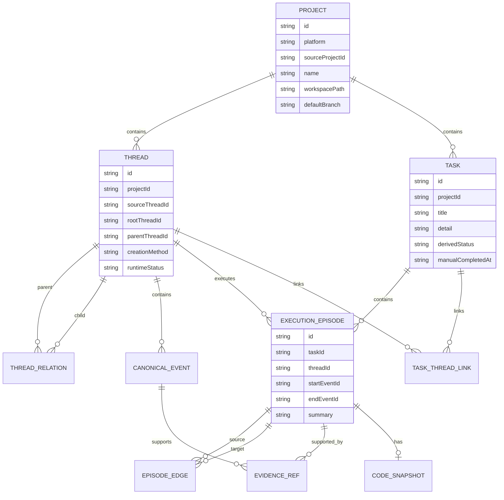

### 7.1 Project

Project 是平台隔离和文件存储的一级边界。

### 7.2 Thread

Thread 是原始会话。人创建且没有父 Thread 的会话是主对话；AI 创建的 Fork、新对话或 Subagent 挂到对应 Root Thread 下。

### 7.3 Task

Task 是可独立验收的工作结果。Task 状态不由模型直接写入：

```text
任一关联 Thread 正在运行 → 进行中
所有关联 Thread 均已停止 → 待验收
用户人工确认              → 已完成
```

### 7.4 Execution Episode

Episode 是任务图节点，表示一个 Task 在一个 Thread 中的一段连续执行过程。

创建新 Episode 的典型条件：

- Task 进入新的 Thread。
- Task 被发送到一个已有 Thread。
- 子 Thread 返回后主 Thread 继续处理。
- 一个 Thread 停止后被重新唤醒。
- 同一 Thread 先处理其他 Task，之后恢复当前 Task。
- 工作区或执行上下文发生实质变化。

普通追问、连续工具调用和同一轮修改不会创建新 Episode。

## 8. Canonical Event

```ts
interface CanonicalEvent {
  schemaVersion: 1;
  eventId: string;
  projectId: string;
  threadId: string;

  sourcePlatform: string;
  sourceLocator: {
    file?: string;
    recordId?: string;
    byteOffset?: number;
    sourceEventId?: string;
    generation: number;
  };

  sequence: number;
  timestamp?: string;

  type:
    | "user_message"
    | "assistant_message"
    | "tool_call"
    | "tool_result"
    | "thread_created"
    | "thread_started"
    | "thread_stopped"
    | "message_sent_to_thread"
    | "workspace_changed"
    | "git_operation";

  actor: "human" | "assistant" | "tool" | "system";
  text?: string;
  structuredPayload?: Record<string, unknown>;
  contentHash: string;
}
```

Event ID 应稳定生成：

```text
hash(platform + sourceThreadId + generation + sourceLocator + contentHash)
```

## 9. JSON 文件存储设计

### 9.1 存储根目录

数据不建议写进被分析的代码仓库，避免污染 Git 状态。默认写入 CodePet 应用数据目录：

```text
${CODEPET_DATA_DIR}/task-lineage/v1/
```

`CODEPET_DATA_DIR` 由 CodePet 按操作系统解析，不允许业务代码自行拼接用户 Home 目录。

### 9.2 目录结构

```text
task-lineage/v1/
├── catalog.json
├── projects/
│   └── {projectId}/
│       ├── project.json
│       ├── lineage.json
│       ├── indexes/
│       │   ├── thread-index.json
│       │   ├── task-index.json
│       │   └── event-index.json
│       ├── threads/
│       │   └── {threadId}/
│       │       ├── thread.json
│       │       ├── scan-state.json
│       │       ├── event-manifest.json
│       │       └── events/
│       │           ├── 00000001-00000200.json
│       │           └── 00000201-00000400.json
│       ├── tasks/
│       │   └── {taskId}.json
│       ├── extraction-revisions/
│       │   └── {jobId}.json
│       ├── transactions/
│       │   ├── {transactionId}.prepared.json
│       │   └── {transactionId}.committed.json
│       ├── projections/
│       │   ├── conversation-tree.json
│       │   ├── task-list.json
│       │   └── task-graphs/
│       │       └── {taskId}.json
│       └── locks/
│           └── writer.lock
└── diagnostics/
    └── latest-health.json
```

### 9.3 文件职责

| 文件 | 是否权威 | 说明 |
|---|---:|---|
| 原始平台 Transcript | 是 | 最原始的一手事实，不由 CodePet 修改 |
| `project.json` | 是 | Project 映射和工作区信息 |
| `thread.json` | 是 | Thread 元数据和运行状态快照 |
| Event Chunk | 是 | 标准化后的事件和 Source Locator |
| `lineage.json` | 是 | 主对话、派生对话和客观创建关系 |
| `{taskId}.json` | 是 | Task 聚合、Thread Link、Episode 和 Edge |
| `scan-state.json` | 是 | 增量处理和失败恢复状态 |
| Extraction Revision | 是 | 抽取输入范围、版本、原始输出和校验结果 |
| Index/Projection | 否 | 为查询性能生成，可以从权威文件重建 |

### 9.4 为什么按聚合分文件

不使用一个巨大的 `data.json`，原因包括：

- 任意小更新都会重写整个文件。
- 文件损坏影响所有 Project。
- 多个 Thread 更新容易发生写冲突。
- Git 和 UI 查询需要反复扫描全量数据。

Task 使用单文件聚合，Task 下的 Episode、Edge 和 Thread Link 一次原子更新，减少跨文件事务。

### 9.5 Task 聚合文件示例

```json
{
  "schemaVersion": 1,
  "revision": 12,
  "taskId": "task_01JZ...",
  "projectId": "project_codepet",
  "title": "构建任务谱系管理",
  "detail": "从原始会话记录中建立 Thread 与 Task 的双向关联，并展示任务跨执行上下文的流转。",
  "createdFrom": {
    "threadId": "thread_main",
    "eventId": "event_1042"
  },
  "manualCompletion": {
    "completed": false,
    "completedAt": null,
    "completedBy": null
  },
  "threadLinks": [
    {
      "threadId": "thread_main",
      "firstEventId": "event_1042",
      "lastEventId": "event_1881"
    },
    {
      "threadId": "thread_fork_1",
      "firstEventId": "event_2001",
      "lastEventId": "event_2280"
    }
  ],
  "episodes": [
    {
      "episodeId": "episode_01",
      "threadId": "thread_main",
      "startEventId": "event_1042",
      "endEventId": "event_1108",
      "summary": "讨论任务谱系的领域模型和展示方式。",
      "startedAt": "2026-09-05T09:10:00+08:00",
      "endedAt": "2026-09-05T09:42:00+08:00",
      "evidenceEventIds": ["event_1042", "event_1058", "event_1108"],
      "codeSnapshot": {
        "workspaceMode": "main_workspace",
        "workspacePath": "/Users/example/codepet",
        "branch": "main",
        "headCommit": "a83f9c2",
        "commitState": "uncommitted",
        "syncState": "not_required",
        "observedAt": "2026-09-05T09:42:10+08:00"
      }
    }
  ],
  "edges": [
    {
      "fromEpisodeId": "episode_01",
      "toEpisodeId": "episode_02",
      "transitionType": "fork",
      "observedEventId": "event_1120"
    }
  ],
  "createdAt": "2026-09-05T09:10:00+08:00",
  "updatedAt": "2026-09-05T14:22:00+08:00"
}
```

`derivedStatus` 不作为不可变事实写入 Task 文件。查询时根据 Thread Runtime 和人工完成字段计算，也可以写入可重建 Projection。

### 9.6 Thread 文件示例

```json
{
  "schemaVersion": 1,
  "revision": 7,
  "threadId": "thread_fork_1",
  "projectId": "project_codepet",
  "platform": "codex",
  "sourceThreadId": "0199...",
  "rootThreadId": "thread_main",
  "parentThreadId": "thread_main",
  "title": "实现任务图",
  "creatorType": "assistant",
  "creationMethod": "fork",
  "runtimeStatus": "ended",
  "workspacePath": "/Users/example/.codex/worktrees/feat-task-lineage",
  "createdAt": "2026-09-05T10:00:00+08:00",
  "lastActivityAt": "2026-09-05T14:08:00+08:00",
  "sourceLocator": {
    "type": "transcript",
    "path": "sessions/0199....jsonl"
  }
}
```

### 9.7 Event Chunk

每个 Thread 的标准化事件按固定上限分块，例如：

- 每 200 个 Event 一个 JSON 数组。
- 或者达到 1～4 MB 后创建新块。
- 已封闭 Chunk 不再修改。
- 当前 Tail Chunk 使用原子重写。

`event-manifest.json`：

```json
{
  "schemaVersion": 1,
  "threadId": "thread_main",
  "generation": 1,
  "chunks": [
    {
      "file": "events/00000001-00000200.json",
      "firstSequence": 1,
      "lastSequence": 200,
      "eventCount": 200,
      "checksum": "sha256:...",
      "sealed": true
    },
    {
      "file": "events/00000201-00000283.json",
      "firstSequence": 201,
      "lastSequence": 283,
      "eventCount": 83,
      "checksum": "sha256:...",
      "sealed": false
    }
  ]
}
```

## 10. JSON 一致性与原子写入

### 10.1 单 Project 单写者

首期采用进程内 Project Writer Queue。同一个 Project 的 Domain Mutation 串行提交，不同 Project 可以并行。

### 10.2 原子文件替换

更新文件时：

1. 在同一目录写入 `{file}.tmp-{transactionId}`。
2. 写入完整 JSON。
3. Flush 文件内容。
4. 校验 JSON 和 checksum。
5. 原子 rename 替换正式文件。
6. 更新目录或文件系统同步点。

禁止直接打开正式文件后原地覆盖。

### 10.3 多文件事务日志

一次抽取可能同时更新 Thread、Task 和索引，因此使用轻量 Transaction Journal。

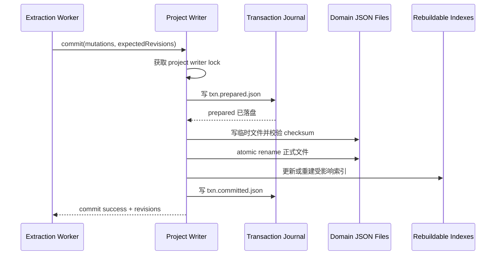

启动恢复规则：

- 只有 `prepared`，没有 `committed`：检查目标文件 revision 和 checksum，决定完成提交或重建索引。
- 已经 `committed`：事务已完成，临时文件可以清理。
- Index/Projection 不一致：从权威 Domain 文件重建。

### 10.4 乐观 Revision

每个可变聚合保存单调递增的 `revision`。

```ts
interface WriteOptions {
  expectedRevision: number;
}
```

如果当前 Revision 与预期不一致，拒绝写入并重新读取、重新 Reconcile，避免旧抽取结果覆盖新人工操作。

## 11. 存储接口

```ts
interface TaskLineageStore {
  projects: ProjectRepository;
  threads: ThreadRepository;
  events: EventRepository;
  tasks: TaskRepository;
  scanStates: ScanStateRepository;
  revisions: ExtractionRevisionRepository;
  projections: ProjectionRepository;

  transaction<T>(
    projectId: string,
    operation: (tx: DomainTransaction) => Promise<T>,
  ): Promise<T>;
}
```

JSON 实现：

```ts
class JsonTaskLineageStore implements TaskLineageStore {
  // 只在此处依赖文件系统和 JSON 编解码
}
```

未来如引入数据库：

```ts
class SqliteTaskLineageStore implements TaskLineageStore {
  // 业务层和 UI API 不变
}
```

## 12. 增量调度设计

### 12.1 Scan State

每个 Thread 保存独立的 `scan-state.json`：

```ts
interface ThreadScanState {
  schemaVersion: 1;
  revision: number;
  threadId: string;

  discoveryCursor?: string;
  observedCursor?: SourceCursor;
  normalizedCursor?: EventCursor;
  extractedCursor?: EventCursor;
  projectedCursor?: EventCursor;

  sourceGeneration: number;
  sourceSize?: number;
  sourceMtime?: string;
  sourcePrefixHash?: string;
  sourceTailHash?: string;

  dirty: boolean;
  dirtyReasons: DirtyReason[];

  state:
    | "clean"
    | "dirty"
    | "queued"
    | "extracting"
    | "retry_wait"
    | "blocked";

  lease?: {
    owner: string;
    expiresAt: string;
  };

  failureCount: number;
  nextRetryAt?: string;
  lastError?: string;

  extractorId?: string;
  extractorVersion?: string;
  promptVersion?: string;
}
```

### 12.2 多游标原因

```text
observedCursor   原始数据读取到哪里
normalizedCursor 成功转换到哪个统一事件
extractedCursor  AI 已分析到哪个统一事件
projectedCursor  UI 查询模型已投影到哪里
```

某阶段失败不会迫使前面成功阶段重新执行。

### 12.3 不使用 Token 作为唯一游标

Token 数依赖 tokenizer，也不能识别 Transcript 截断或重写。游标优先级：

1. 平台稳定 Event ID。
2. 单调递增 Sequence。
3. 文件 Byte Offset。
4. 时间戳、内容 Hash 和 Source Generation。
5. 消息索引。

### 12.4 Transcript 重写检测

如果出现以下情况，增加 `sourceGeneration` 并重新标准化受影响区间：

- 文件大小减小。
- 已处理前缀 Hash 不匹配。
- 相同 Source Event ID 内容发生变化。
- 平台 Session 被 Fork 或迁移后来源发生替换。

### 12.5 调度状态机

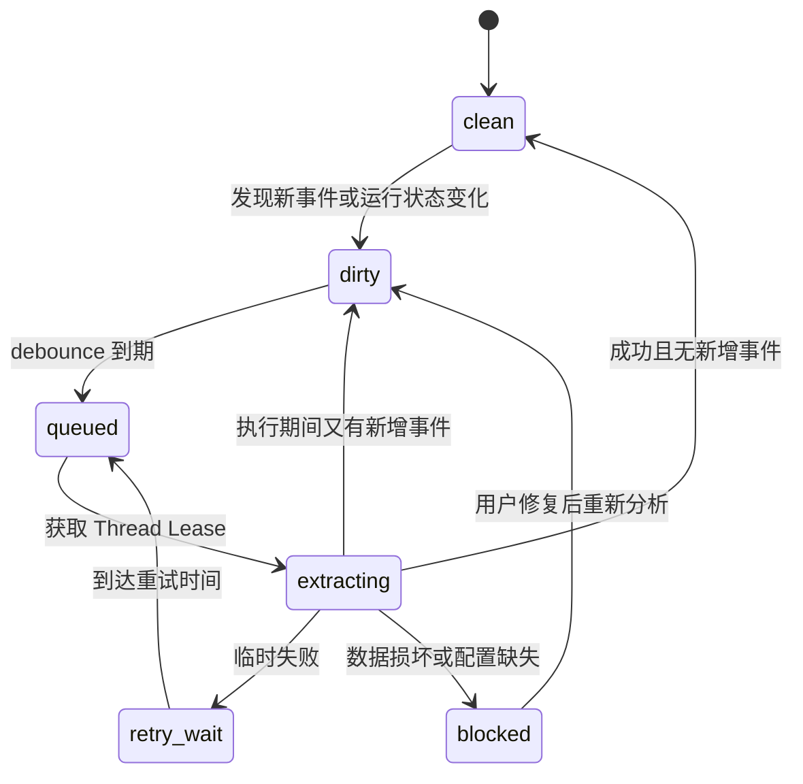

### 12.6 队列持久化策略

首期队列保存在内存，不为每个 Job 单独实现复杂的磁盘队列。不会因此丢失任务，因为：

- `scan-state.json` 是持久化事实。
- 进入 `queued`、`extracting` 或 `retry_wait` 都先原子写 Scan State。
- 应用启动时扫描所有 Scan State。
- `dirty`、`queued`、过期 `extracting` 和到期 `retry_wait` 会重新入队。

## 13. 抽取执行器

抽取执行器与数据源完全解耦。

```ts
interface ExtractionExecutor {
  readonly id: string;

  execute<TInput, TOutput>(
    request: ExecutorRequest<TInput, TOutput>,
  ): Promise<ExecutorResponse<TOutput>>;

  healthCheck(): Promise<ExecutorHealth>;
}
```

配置示例：

```yaml
extractors:
  local-codex:
    type: cli
    command: codex
    args: ["exec", "--json"]
    model: gpt-5.6-luna
    timeoutSeconds: 120
    concurrency: 2

  remote-assistant:
    type: openai-compatible
    baseUrl: https://example.invalid/v1
    model: task-extractor-v2
    credentialRef: assistant-service

routing:
  defaultExtractor: local-codex
  platforms:
    qoder:
      extractor: remote-assistant
```

安全要求：

- CLI 使用 `command + argv`，禁止字符串拼接后交给 Shell。
- 环境变量使用显式 allowlist。
- Credential 只保存引用，不写入 Task Lineage JSON。
- 远程抽取默认关闭，启用时明确提示 Transcript 会被发送到远端。

## 14. AI 抽取协议

### 14.1 输入

```ts
interface ExtractionRequest {
  project: {
    projectId: string;
    name: string;
  };

  thread: {
    threadId: string;
    title: string;
    rootThreadId: string;
    parentThreadId?: string;
    creationMethod: string;
  };

  existingTaskCandidates: Array<{
    taskId: string;
    title: string;
    detail: string;
    recentEpisodeSummaries: string[];
  }>;

  openEpisodes: Array<{
    episodeId: string;
    taskId: string;
    threadId: string;
    summary: string;
  }>;

  overlapEvents: CanonicalEvent[];
  newEvents: CanonicalEvent[];

  cursor: {
    previousExtractedEventId?: string;
    targetLastEventId: string;
  };
}
```

### 14.2 输出

```ts
interface ExtractionResult {
  taskChanges: Array<{
    operation: "create" | "update" | "link" | "noop";
    taskRef?: string;
    existingTaskId?: string;
    title?: string;
    detail?: string;
    decision:
      | "new_task"
      | "continue_task"
      | "switch_task"
      | "resume_task";
    evidenceEventIds: string[];
  }>;

  episodeChanges: Array<{
    operation: "start" | "extend" | "close";
    taskRef: string;
    existingEpisodeId?: string;
    summary: string;
    startEventId?: string;
    endEventId?: string;
    evidenceEventIds: string[];
  }>;

  unresolvedItems: Array<{
    description: string;
    evidenceEventIds: string[];
  }>;
}
```

### 14.3 Task 候选范围

只提供以下候选，避免跨 Project 错误归并：

- 当前 Root Thread 已关联 Task。
- 当前 Thread 最近关联 Task。
- 被明确重新唤醒的 Task。
- 当前 Project 少量最近活跃 Task。

### 14.4 重叠窗口

每次增量抽取输入：

```text
最近 10～30 个已处理 Event
+ 未关闭 Episode 摘要
+ Task 候选摘要
+ 本次新增 Event
```

重叠 Event 只用于边界理解，不能重复产生实体。所有 Mutation 必须携带 Evidence Event ID。

## 15. 关键时序图

### 15.1 应用启动与恢复

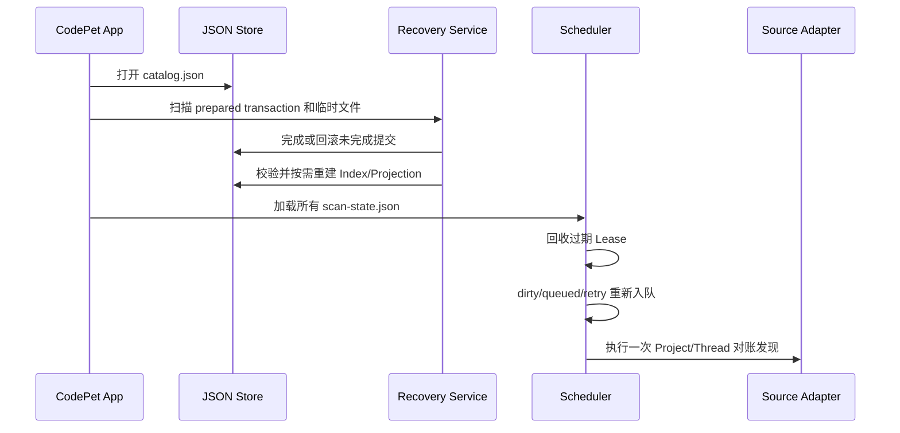

### 15.2 新增 Transcript 的增量处理

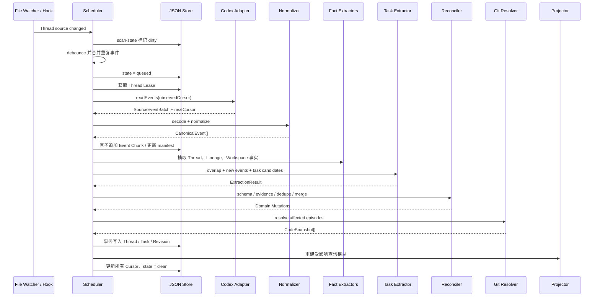

### 15.3 抽取过程中又出现新增记录

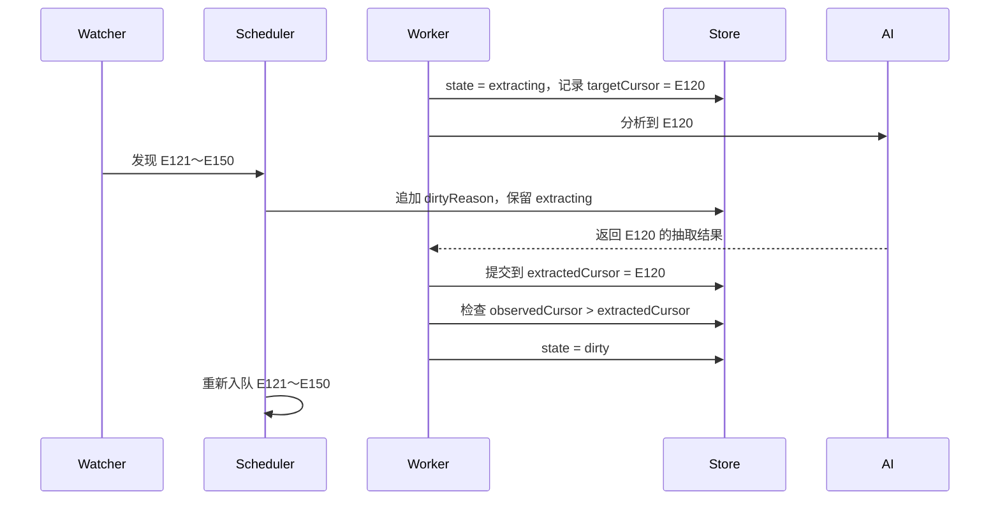

这个设计防止 Worker 成功后错误清除执行期间产生的 Dirty 状态。

### 15.4 主对话派生新 Thread

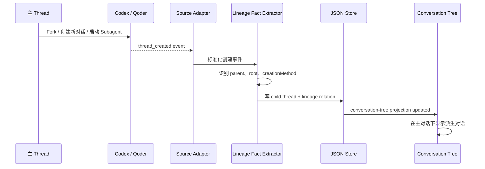

### 15.5 同一个 Thread 从 Task A 切换到 Task B

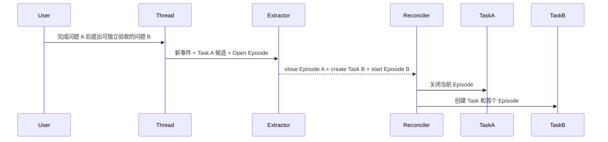

### 15.6 Task 在多个 Thread 并行执行并汇合

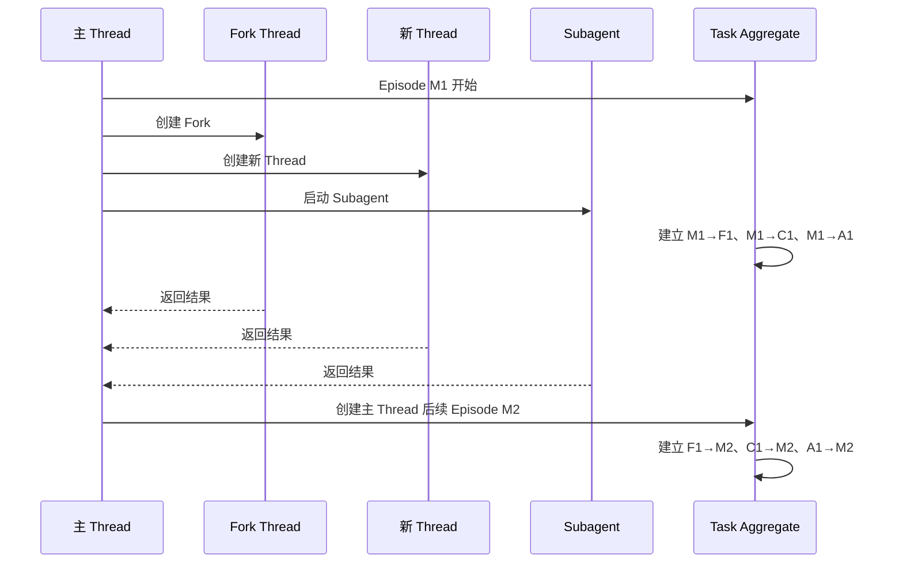

### 15.7 Git 状态补全

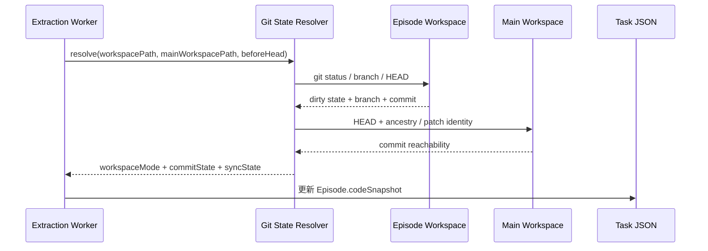

### 15.8 前端查看主对话与 Task

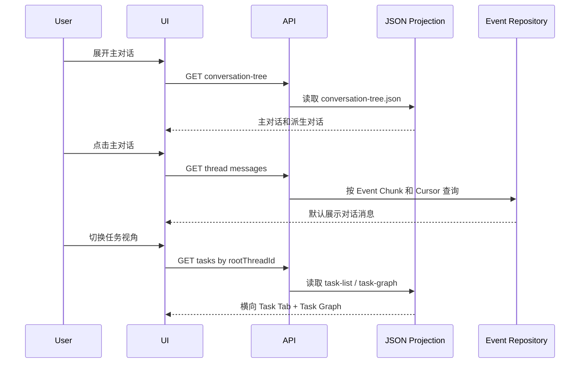

### 15.9 任务节点查看消息并继续对话

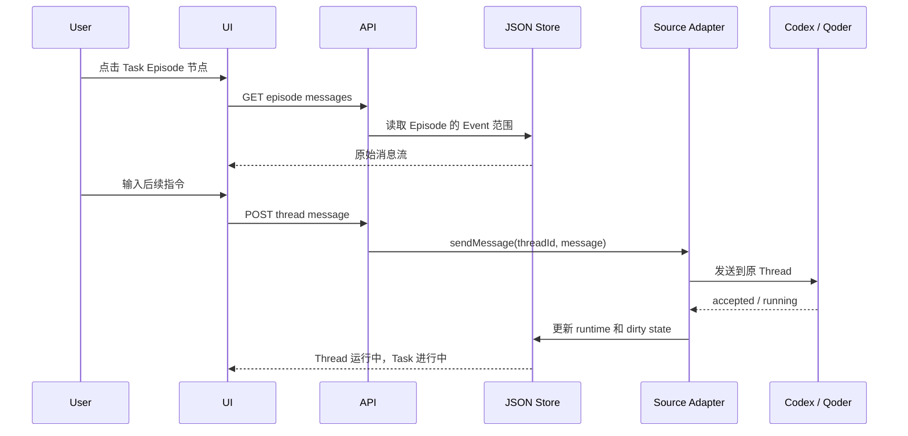

### 15.10 人工验收完成

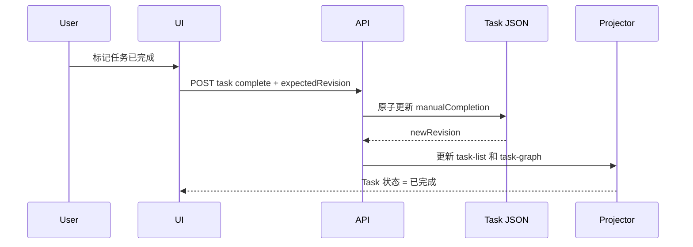

## 16. API 与查询模型

### 16.1 对话树

```http
GET /api/projects/:projectId/conversation-tree
```

### 16.2 对话消息

```http
GET /api/threads/:threadId/messages?cursor=&limit=
```

中间对话消息和右侧 Episode 消息必须复用同一套 Message DTO 和前端 MessageList 组件。

### 16.3 Task 列表

```http
GET /api/projects/:projectId/tasks
GET /api/threads/:rootThreadId/tasks
```

### 16.4 Task 图

```http
GET /api/tasks/:taskId/graph
```

### 16.5 Episode 消息

```http
GET /api/episodes/:episodeId/messages?cursor=&limit=
```

Episode 只保存 Event 范围和 Evidence 引用，不复制一份消息正文。

### 16.6 继续对话

```http
POST /api/threads/:threadId/messages
```

### 16.7 人工完成

```http
POST /api/tasks/:taskId/complete
Content-Type: application/json

{
  "expectedRevision": 12
}
```

### 16.8 实时事件

本地首期可以使用 SSE：

```text
thread.updated
thread.lineage_updated
task.updated
episode.updated
task.graph_updated
scan.state_changed
```

## 17. 查询 Projection

Projection 不是权威数据，只用于避免前端扫描大量 JSON：

- `conversation-tree.json`：按主对话聚合派生 Thread。
- `task-list.json`：按更新时间和状态排列 Task。
- `task-graphs/{taskId}.json`：Task、Episode、Edge 和 Code Snapshot 的前端 DTO。

Projection 文件损坏或版本不兼容时，删除并从 Project、Thread 和 Task 权威文件重建。

## 18. 幂等、去重与版本

### 18.1 Job 幂等键

```text
hash(
  threadId
  + sourceGeneration
  + normalizedEventRange
  + extractorId
  + extractorVersion
  + promptVersion
)
```

### 18.2 Task 去重

按以下顺序判断：

1. 模型明确选择 `existingTaskId`。
2. Evidence 范围是否已经被某 Task 消费。
3. 是否存在当前 Thread 的 Open Episode。
4. 是否与 Root Thread 最近 Task 连续。
5. 标题或向量相似度只能作为候选提示，不能单独自动合并。

### 18.3 Schema 和 Prompt 版本

每次 Extraction Revision 保存：

- `schemaVersion`
- `extractorId`
- `extractorVersion`
- `promptVersion`
- `inputHash`
- 输入 Event 范围
- 原始模型输出
- 校验后的 Mutation
- 应用结果

Prompt 更新后可以重新抽取，但不得覆盖 `manualCompletion` 和其他人工修改。

## 19. 文件迁移

每个文件必须包含 `schemaVersion`。

```ts
interface JsonMigration<TFrom, TTo> {
  fromVersion: number;
  toVersion: number;
  migrate(value: TFrom): TTo;
}
```

迁移流程：

1. 启动时读取 Catalog 和 Project Schema Version。
2. 对需要迁移的文件创建备份或事务 Journal。
3. 按版本顺序执行纯函数迁移。
4. 校验新 Schema。
5. 原子替换。
6. 重建 Index 和 Projection。

## 20. 可观测性与诊断

每次抽取记录：

- Project、Thread、Source Platform。
- 输入 Event 范围和数量。
- 重叠 Event 数量。
- Extractor、模型和 Prompt 版本。
- 输入输出 Token、执行时间、重试次数。
- Schema 校验结果。
- 新建、更新、关联的 Task 和 Episode 数量。
- Evidence 缺失或无法判定的项目。
- Git 解析结果。
- JSON 事务 ID 和修改的文件。

建议提供本地诊断视图：

```text
Thread
├── Source Generation
├── Observed Cursor
├── Normalized Cursor
├── Extracted Cursor
├── Projected Cursor
├── Dirty Reasons
├── Current Lease
├── Last Extraction Revision
├── Raw Model Output
├── Validated Mutations
└── Evidence Links
```

## 21. 安全与隐私

- 默认本地读取、本地存储、本地抽取。
- 原始 Transcript 不复制到 Task 文件，只保存必要 Event 和 Source Locator。
- 远程 Extractor 必须显式开启。
- 远程发送前支持路径、密钥和敏感内容脱敏。
- JSON 日志不得记录 Credential、环境变量全集或原始 Secret。
- Source Adapter 的消息发送能力必须限制在用户选中的 Thread。
- 删除、重新分析和覆盖人工结果应提供明确确认或可恢复 Revision。

## 22. 测试策略

### 22.1 Adapter 合约测试

- 增量读取不重复。
- Cursor 可恢复。
- Thread 父子关系正确。
- 消息顺序稳定。
- Transcript 截断或重写能够发现。

### 22.2 Golden Transcript 测试

覆盖：

- 一个 Thread 一个 Task。
- 一个 Thread 多个 Task。
- Task 切换后恢复。
- 主 Thread 派生三个并行 Thread。
- 子 Thread 结束后主 Thread 继续。
- 同一个子 Thread 被重新唤醒。
- Transcript 追加、截断和重写。
- 无代码 Task。
- worktree 已提交未同步。
- worktree 已同步主工作区。

### 22.3 JSON Store 测试

- 原子替换失败后正式文件仍可读。
- Prepared Transaction 可以恢复。
- Revision 冲突不会覆盖新数据。
- Index 删除后可以重建。
- Tail Event Chunk 重写幂等。
- Sealed Chunk 不被修改。

### 22.4 抽取幂等测试

相同 Event 范围执行两次：

- 不重复创建 Task。
- 不重复创建 Episode。
- 不重复创建 Edge。
- 不改变人工完成状态。

### 22.5 UI 合约测试

- 对话树只在一级显示主对话。
- 派生对话显示标题和创建方式。
- 选择 Thread 默认进入对话视图。
- 只有主对话显示 Task 入口。
- 中间和右侧消息流使用相同 Message DTO。
- Task 节点显示工作模式、提交和同步状态。

## 23. 推荐代码结构

```text
src/task-lineage/
├── domain/
│   ├── project.ts
│   ├── thread.ts
│   ├── task.ts
│   ├── episode.ts
│   └── events.ts
├── sources/
│   ├── source-adapter.ts
│   ├── registry.ts
│   ├── codex/
│   └── qoder/
├── normalization/
│   ├── canonical-event.ts
│   ├── transcript-strategy.ts
│   └── fact-extractors/
├── extraction/
│   ├── extraction-service.ts
│   ├── extraction-executor.ts
│   ├── executor-registry.ts
│   ├── schemas/
│   ├── prompts/
│   └── reconciler.ts
├── scheduler/
│   ├── discovery.ts
│   ├── dirty-tracker.ts
│   ├── queue.ts
│   ├── leases.ts
│   ├── worker.ts
│   └── recovery.ts
├── storage/
│   ├── task-lineage-store.ts
│   ├── json/
│   │   ├── json-store.ts
│   │   ├── atomic-writer.ts
│   │   ├── transaction-journal.ts
│   │   ├── migrations.ts
│   │   └── repositories/
│   └── projections/
├── git/
│   ├── workspace-resolver.ts
│   ├── commit-resolver.ts
│   └── sync-resolver.ts
├── application/
│   ├── queries/
│   ├── commands/
│   └── dto/
└── api/
    ├── conversation-routes.ts
    ├── task-routes.ts
    └── event-stream.ts
```

## 24. 分阶段实施计划

### 阶段一：JSON Store 和 Codex 事实链路

- 定义领域类型和 Repository 接口。
- 实现 Atomic JSON Writer、Revision 和 Transaction Journal。
- 实现 Codex Project/Thread 发现。
- 实现 Transcript 增量读取和 Canonical Event。
- 实现主对话和派生对话树。

验收标准：重启应用后，对话树、消息和扫描游标可以完整恢复。

### 阶段二：Task/Episode 抽取

- 实现 Extraction Executor 接口。
- 实现一个本地 Codex Executor。
- 固化输入输出 JSON Schema。
- 实现 Task Candidate 选择和 Reconciler。
- 保存 Evidence 和 Extraction Revision。

验收标准：同一 Transcript 重复执行不会重复创建 Task 或 Episode。

### 阶段三：Git 状态和任务状态

- 实现主工作区/worktree 识别。
- 实现提交状态。
- 实现同步到主工作区状态。
- 实现 Task 三态派生和人工完成。

验收标准：UI 节点状态与真实 Git 仓库一致，重新抽取不会覆盖人工完成状态。

### 阶段四：现有 UI 接入

- 接入对话树和消息 API。
- 接入 Task 图和泳道 Projection。
- 接入可复用 MessageList。
- 接入继续对话和人工验收。
- 使用 SSE 更新运行状态和抽取结果。

验收标准：从主对话、派生对话、Task 节点都能回到正确消息范围，并可继续对应 Thread。

### 阶段五：Qoder 验证

- 新增 Qoder Adapter 和 Transcript Strategy。
- 复用已有 Canonical Event、Task、Episode、Store、Scheduler 和 UI。

验收标准：接入 Qoder 不需要修改统一领域模型和前端 DTO；如果必须修改，应先评估是否为领域缺失，而不是把平台字段泄漏到核心层。

## 25. MVP 最小闭环

首个可用版本只需要完成：

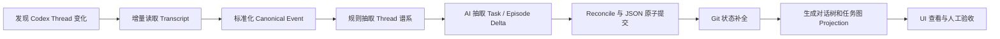

不需要在 MVP 中立即实现：

- 多 Extractor 自动路由。
- 跨设备同步。
- 多用户协作。
- 向量数据库。
- 复杂的远程持久化队列。
- 自动冲突解决。

## 26. 关键决策总结

1. 使用三层业务架构：分析抽取、增量调度、任务管理展示。
2. 统一领域模型和 JSON Repository 作为横向基础设施。
3. 平台原始格式通过 Adapter 和 Transcript Strategy 隔离。
4. AI 只输出带 Evidence 的 Task/Episode 增量，不输出最终领域快照。
5. Task 使用聚合 JSON 文件，Episode 和 Edge 与 Task 一起原子提交。
6. Event 按 Thread 分块，避免超大 JSON 文件。
7. 队列保存在内存，Scan State 持久化，应用重启后重新入队。
8. 使用 Project 单写者、Atomic Rename、Revision 和 Transaction Journal 提供一致性。
9. Index 和 Projection 可重建，不作为权威数据。
10. “已完成”只能由人工确认；Git 和同步状态必须真实核验。

## 27. 现状理解

当前仓库已经具备 Provider、Conversation 和 Turn 的统一协议及运行时投影：`protocol/provider/` 定义 Provider 领域协议，`crates/providers/` 包装不同 AI 工具，`frontend/lib/runtimeGateway.ts` 提供对话查询入口，`frontend/lib/runtimeGatewayActivity.ts` 将 Provider 会话和 Turn 映射到当前活动视图。应用设置和部分本地状态已使用 JSON 文件持久化，相关约束记录在 `knowledge/10-architecture/settings-persistence.md`。

本方案中的 Task、Execution Episode、增量抽取调度器和任务谱系查询模型仍是目标能力，仓库当前实现不能被视为已经支持这些对象。

## 28. 涉及模块

- `protocol/provider/`：需要评估现有 Conversation/Turn 契约能否提供抽取、谱系和继续对话所需的稳定标识与能力声明。
- `crates/providers/`：负责 Codex、Qoder、OpenCode 等来源差异、Transcript 读取和平台事实标准化。
- `src-tauri/src/`：承载本地增量调度、JSON Repository、Git/worktree 核验和 Tauri command。
- `frontend/`：承载主对话树、Task 查询、自由图、泳道图、节点详情和消息复用组件。
- `prototypes/task-lineage-management/`：仅用于验证设计和交互，不作为生产运行时依赖。

## 29. 风险

- 平台 Transcript 缺少稳定父子关系：通过 Provider 能力声明和 evidence confidence 显式降级，并用真实 Codex/Qoder 样本验证。
- AI 抽取在增量边界附近重复、拆错或合错 Task：保存证据范围、稳定 ID 和抽取版本，使用回放数据集做幂等与归并测试。
- JSON 多文件更新中断后产生不一致：使用单写者、临时文件原子替换和 transaction journal，增加故障注入恢复测试。
- worktree 已提交不等于已同步：分别计算 commit state 和 main-workspace sync state，并用多分支 Git fixture 验证。
- 对话仍有新消息时抽取结果覆盖用户操作：通过 source revision 和 optimistic revision 拒绝陈旧写入。
- Transcript 可能包含敏感内容：默认只在本地处理和存储；远程抽取执行器需要独立告知和配置开关。

## 30. 测试计划

- 为每个 Source Adapter 建立真实结构脱敏后的 Transcript fixture 和游标续扫测试。
- 验证相同输入重复扫描不会产生重复 Task、Episode 或 lineage edge。
- 验证扫描过程中追加记录时会保留 dirty 状态并继续下一轮。
- 对 JSON Repository 执行临时文件、rename、journal 回放和损坏索引重建测试。
- 对 Task 三态、Thread 两态和人工完成覆盖规则执行领域测试。
- 对主工作区、干净/脏 worktree、已提交未同步、已同步等 Git fixture 执行状态测试。
- 对前端执行主/子对话选择、Task 切换、图/泳道切换、节点回溯和继续发送消息测试。
- 使用大体量 Transcript 做启动恢复、增量扫描耗时和 JSON 分片体积基准测试。

## 31. 知识沉淀

- 本文作为目标架构和实现计划持续更新。
- 用户可见行为同步维护在 `knowledge/20-product/task-lineage-management.md`。
- 若实现中确定新的跨 Provider 稳定约束，应新增到 `knowledge/60-rules/`。
- 若形成 Transcript 损坏、游标恢复或 JSON 修复流程，应新增到 `knowledge/40-runbooks/`。
- 若最终放弃 JSON 或改变 Task/Thread 领域边界，应新增正式架构决策，而不是直接改写历史理由。

## 32. 未知项

- Codex、Qoder、OpenCode 对 Fork、新对话和 Subagent 父子关系提供的证据完整度尚未用统一样本集验证。
- Qoder 当前已有会话回复能力受限；Task 节点“继续发送消息”的降级交互需要结合 Provider capability 最终确定。
- AI 抽取执行器的默认模型、成本上限、上下文切片大小和质量阈值尚未通过基准集确定。
- JSON Store 的单项目分片阈值和转向 SQLite 的量化触发条件尚未通过真实长期数据确定。
- 主工作区“已同步”的精确定义需要在 rebase、squash、cherry-pick 等提交拓扑上进一步验证。
