# CodePet 任务谱系管理 UI 设计稿

> 版本：V1.0
>
> 日期：2026-09-05
>
> 形态：桌面端 Web / Desktop App
>
> 对应技术方案：[CodePet 任务谱系技术设计](../10-architecture/task-lineage-and-extraction.md)
>
> 可交互原型：[`prototypes/task-lineage-management`](../../prototypes/task-lineage-management/)

---

## 1. 设计结论

任务谱系管理不是一个脱离 Codex 的项目管理系统，而是一个建立在原始 AI 对话之上的“任务导航与闭环界面”。

界面采用固定三栏：

1. 左栏管理主对话、派生对话和任务入口；
2. 中栏承载当前主要工作视角：原始对话或任务流；
3. 右栏展示选中对象的可核验事实，并提供回到对应线程继续对话的入口。

系统始终保留两条互相可逆的路径：

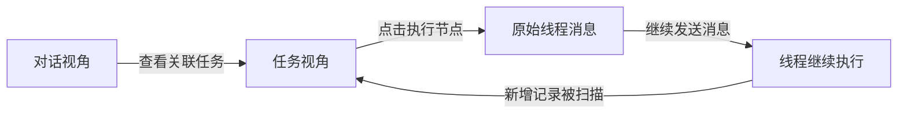

设计重点不是创造更多任务概念，而是减少用户失去对 Codex 原生线程的掌控感。

---

## 2. 用户目标

### 2.1 核心目标

- 快速判断哪些主对话是由自己发起的；
- 查看一个主对话派生出了哪些 Fork、新对话和 Subagent；
- 查看一个主对话内被识别出了哪些任务；
- 查看一个任务如何在多个线程之间分叉、汇合和反复流转；
- 知道每个执行节点目前是否仍在运行；
- 知道代码在哪个工作区或 worktree、是否提交、是否同步到主工作区；
- 从任一任务节点返回对应线程，继续要求 Agent 验收、构建、提交或修正；
- 最终由用户人工确认任务已完成。

### 2.2 不承担的目标

- 不替代 Codex/Qoder 的完整对话能力；
- 不引入负责人、优先级、截止日期等传统项目管理字段；
- 不推断线程的“实现、测试、数据、评审”等语义角色；
- 不推断连线代表“派发、驳回、验收失败”等业务含义；
- 不将每次用户消息机械拆成一个 Task；
- 不在主界面暴露扫描游标、dirty revision 等内部调度细节。

---

## 3. 信息架构

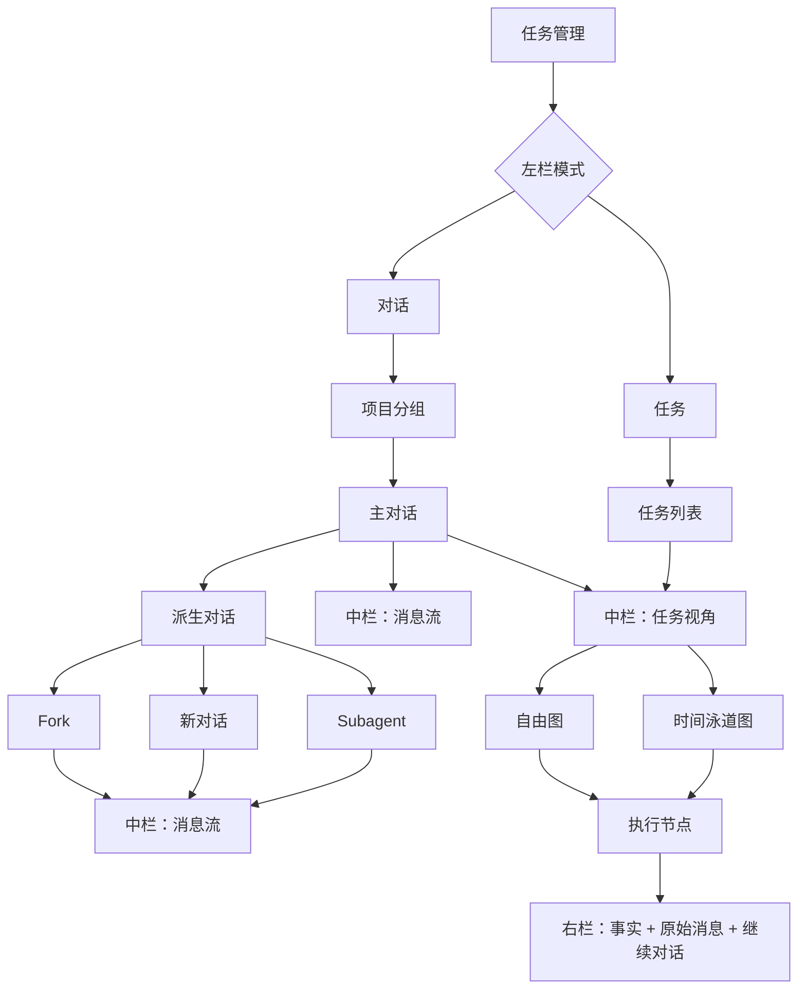

### 3.1 一级入口

产品只有一个一级入口：`任务管理`。

入口内部提供两种导航模式：

- `对话`：以用户发起的主对话为第一层；
- `任务`：以抽取后的 Task 为第一层。

两者只是不同索引，不是两套互相独立的数据。

### 3.2 对话层级

对话列表以项目分组。第一层只展示 `createdBy = human` 的主对话，派生线程折叠在主对话下方。

允许展示的创建方式只有：

- 主对话；
- Fork；
- 新对话；
- Subagent。

不展示推断角色。

### 3.3 Task 粒度

Task 是一段可独立验收的工作目标，不等于消息、线程或单次工具调用。

一个主对话可以包含多个 Task；一个 Task 也可以跨多个 Thread。

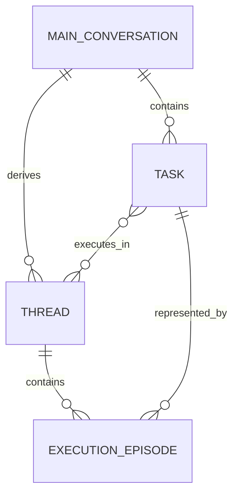

---

## 4. 关键视觉稿

### 4.1 对话默认视角

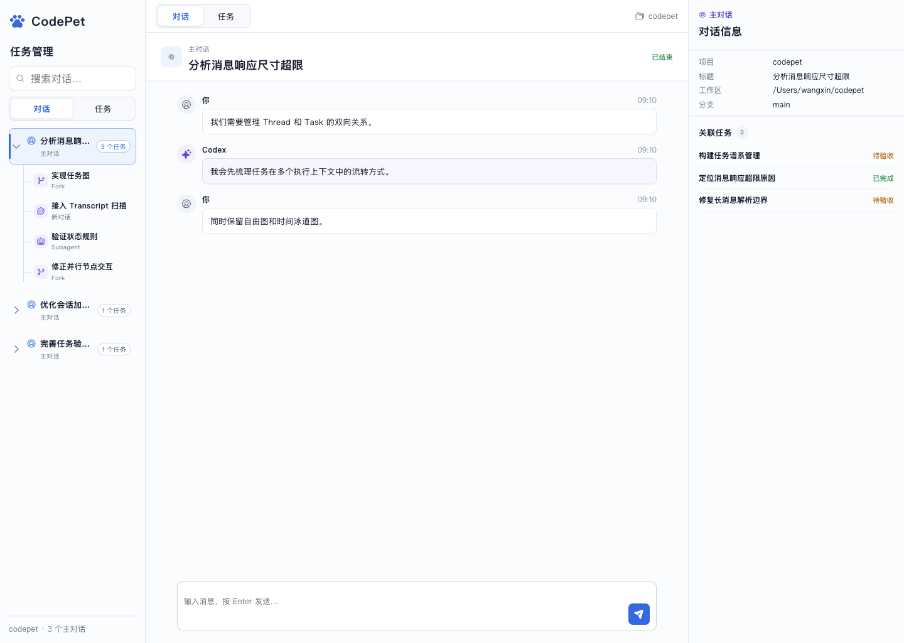

进入主对话后默认展示消息流。中栏不重复展示任务图，右栏只显示当前对话的可核验信息和关联任务。

### 4.2 自由任务图

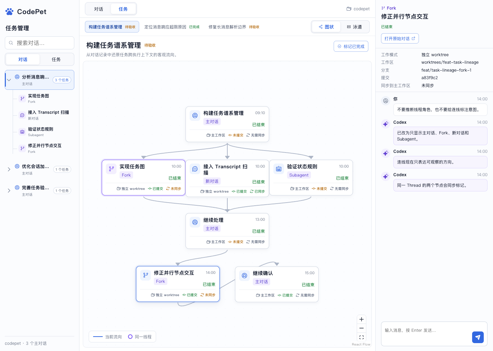

自由图用于快速理解分叉、汇合、回流和当前执行路径。

### 4.3 时间泳道图

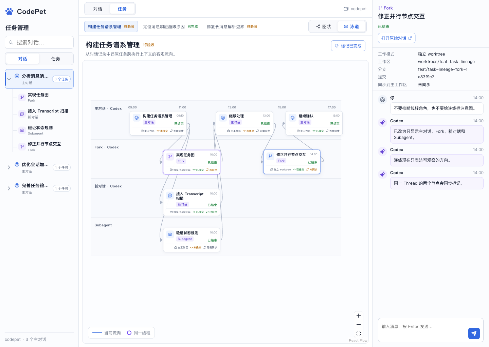

泳道图用于回答“哪个线程在什么时间做了什么”，同一线程发生多次交互时会出现在同一泳道。

---

## 5. 总体布局

```text
┌──────────────────────┬────────────────────────────────────────────┬──────────────────────────────┐
│ 左栏 232px           │ 中栏 min 620px / 自适应                   │ 右栏 344px                   │
│                      │                                            │                              │
│ 任务管理             │ 对话 / 任务                               │ 对话信息 / 节点信息          │
│ 搜索                 │                                            │ 可核验事实                   │
│ 对话 | 任务          │ 消息流                                    │ 原始消息                     │
│                      │ 或                                         │                              │
│ 主对话树 / Task 列表 │ Task 选择 + 图 / 泳道                     │ 继续发送消息                 │
└──────────────────────┴────────────────────────────────────────────┴──────────────────────────────┘
```

### 5.1 桌面布局规格

| 区域 | 默认宽度 | 最小宽度 | 滚动方式 |
|---|---:|---:|---|
| 左侧导航 | 232px | 220px | 列表内部纵向滚动 |
| 中间工作区 | 自适应 | 620px | 消息或画布内部滚动 |
| 右侧检查器 | 344px | 330px | 消息内部纵向滚动 |

页面高度使用视口高度。三栏各自控制滚动，避免滚动中丢失当前任务上下文。

### 5.2 密度原则

- 一级对话行高约 58px；
- 子对话行高约 46px；
- 顶部工具栏约 48–52px；
- Task 节点宽 205–220px，高 88–94px；
- 主文案 12–13px，标题 17–20px，辅助信息 10–11px；
- 状态尽量使用文字颜色，不堆叠大面积 Badge；
- 节点信息固定对齐，不因内容长度改变视觉顺序。

---

## 6. 左栏：对话管理

### 6.1 顶部结构

从上到下依次是：

1. CodePet 品牌和 `任务管理` 标题；
2. 搜索框；
3. `对话 / 任务` 分段切换；
4. 当前模式列表；
5. 项目和主对话数量摘要。

搜索作用于当前模式：

- 对话模式搜索主对话标题和派生对话标题；
- 任务模式搜索 Task 名称和摘要；
- 命中子对话时自动展开其所属主对话；
- 搜索结果不改变父子关系。

### 6.2 主对话行

主对话行展示：

- 展开/收起控制；
- 主对话图标；
- 标题；
- `主对话`；
- 关联 Task 数量。

不展示 `已结束`。原因是主对话停止运行不代表其关联 Task 已完成，也不代表子线程没有运行。

### 6.3 子对话行

子对话行展示：

- 与父级相连的树线；
- 创建方式图标；
- 标题；
- Fork / 新对话 / Subagent。

不展示 Task 验收状态。Thread 只有运行态：

- 运行中；
- 已结束。

运行态只在需要提示时以小型状态点或右侧详情显示，不与任务三态混用。

### 6.4 选择规则

| 操作 | 中栏结果 | 可否切换 Task |
|---|---|---|
| 选择主对话 | 默认展示该对话消息流 | 可以 |
| 选择 Fork | 展示 Fork 消息流 | 不可以 |
| 选择新对话 | 展示该线程消息流 | 不可以 |
| 选择 Subagent | 展示 Subagent 消息流 | 不可以 |
| 切到 Task 模式并选择 Task | 展示 Task 流转 | 已在 Task 视角 |

---

## 7. 中栏：对话视角

### 7.1 顶部

主对话顶部显示 `对话 / 任务` 切换；派生对话只显示 `对话`。

右侧保留项目名称，帮助用户确认当前数据边界。

### 7.2 对话标题区

显示：

- 创建方式；
- 对话标题；
- Thread 运行状态。

不显示任务状态，防止将 Thread 和 Task 混为一谈。

### 7.3 消息列表

消息列表使用统一的 `MessageList` 组件：

```ts
type MessageListProps = {
  messages: MessageViewModel[];
  contextTitle: string;
  canSend: boolean;
  sending: boolean;
  onSend?: (text: string) => Promise<void>;
  density: 'comfortable' | 'compact';
};
```

中栏使用 `comfortable`，右栏使用 `compact`。消息数据、发送逻辑、发送中状态和错误处理完全复用。

### 7.4 发送消息

发送消息后：

1. 输入内容立即进入本地发送态；
2. 调用平台对应的 Thread Provider；
3. Thread 标记为运行中；
4. 调度层在新增 Transcript 到达后触发扫描；
5. Task 图中的执行节点和任务状态随扫描结果更新。

---

## 8. 中栏：Task 视角

### 8.1 Task 横向选择器

主对话进入 Task 视角后，顶部先显示该主对话的 Task 选择器。

每个选项只包含：

- Task 名称；
- Task 状态。

选项数量必须与左栏主对话行显示的 Task 数一致。若抽取结果变化，两个位置由同一查询模型同时更新。

### 8.2 Task 标题区

显示：

- Task 名称；
- 当前状态；
- 一句话目标摘要；
- `标记已完成` 操作。

`标记已完成` 仅在 `待验收` 状态下突出显示；进行中的任务应先处理运行线程，避免误完成。

### 8.3 两种可视化

#### 自由图

适用于：

- 快速理解整体拓扑；
- 观察并行分叉；
- 观察多个上下文汇合；
- 识别任务回流到此前 Thread。

图只表达有证据的节点和方向，不给连线添加语义标签。

#### 时间泳道图

适用于：

- 理解事件发生顺序；
- 查看多个线程的并行区间；
- 观察主线程与派生线程之间的往返；
- 判断同一 Thread 被重新启用的次数。

泳道名称只使用可核验的创建方式和平台，例如：

- 主对话 · Codex；
- Fork · Codex；
- 新对话 · Qoder；
- Subagent。

---

## 9. 执行节点设计

### 9.1 节点代表什么

一个节点代表某个 Task 在一个独立执行上下文中的一段连续执行 Episode。

同一个 Thread 在任务生命周期内被多次重新启用时，可以出现多个节点。这些节点共享 `threadId`，但拥有不同的消息范围和时间范围。

### 9.2 节点固定信息

每个节点无需打开右栏即可看到：

1. Episode 标题；
2. 创建方式；
3. Thread 运行状态；
4. 时间；
5. 工作模式；
6. 提交状态；
7. 与主工作区同步状态。

节点底部事实栏固定为三段：

```text
[工作模式]   [提交状态]   [同步状态]
```

允许值如下：

| 字段 | 允许值 |
|---|---|
| 工作模式 | 主工作区、独立 worktree |
| 提交状态 | 已提交、未提交、无代码变化 |
| 同步状态 | 已同步、未同步、无需同步、未知 |

### 9.3 状态颜色

| 颜色 | 含义 |
|---|---|
| 蓝色 | 当前选择、当前路径、运行中 |
| 紫色 | 派生上下文、同 Thread 联动 |
| 绿色 | 已结束、已提交、已同步、已完成 |
| 琥珀色 | 待验收、未提交、未同步 |
| 灰色 | 次要信息、无需同步、未知 |

颜色只作为辅助，状态必须保留文字。

### 9.4 Hover 联动

Hover 一个节点时同时产生两套反馈：

- 当前节点的上游和下游可达路径以蓝色高亮；
- 所有 `threadId` 相同的其他 Episode 以紫色描边；
- 与当前路径无关的节点和边降低透明度；
- Hover 不改变右栏当前已选择的节点。

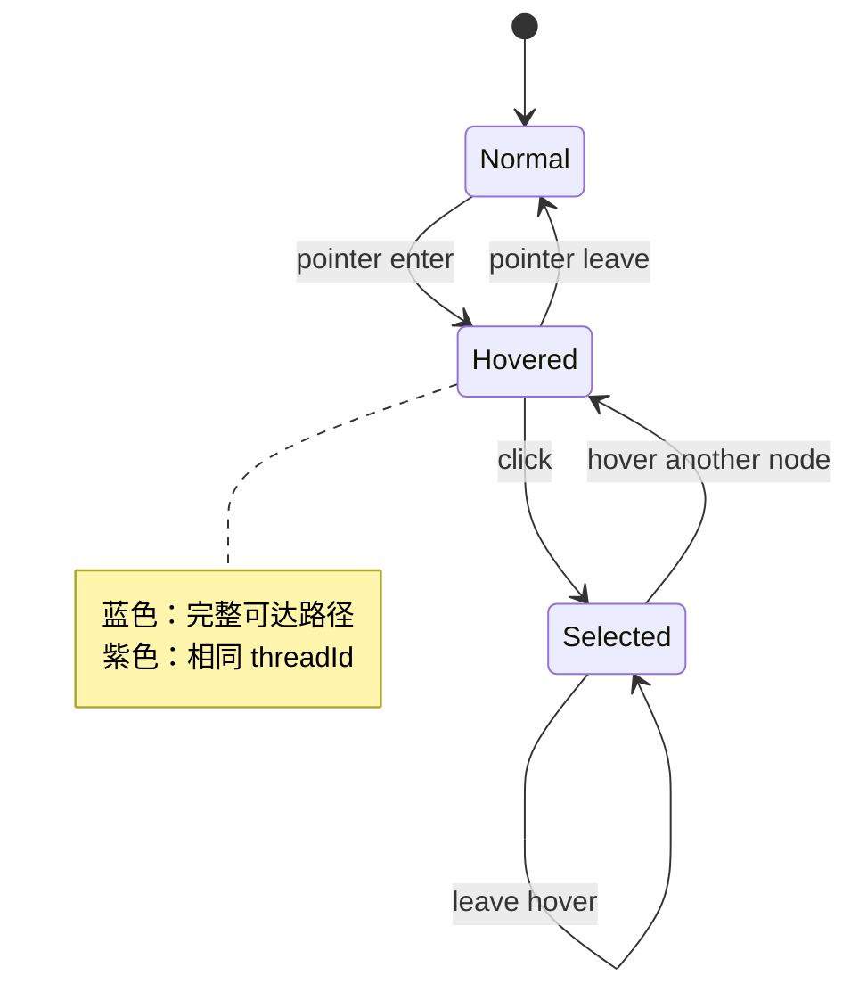

### 9.5 点击节点

点击节点后：

- 节点保持选中；
- 右栏切换到该 Episode；
- 右栏消息只显示 `messageRange` 对应的原始消息；
- 提供“打开原始对话”和直接发送消息两种操作；
- 切换图/泳道时保持同一节点选择。

---

## 10. 右栏：详情与操作

### 10.1 对话模式

选择左栏对话时，右栏显示：

- 项目；
- 对话标题；
- 工作区；
- 分支；
- 关联 Task 列表。

关联 Task 可以点击，点击后将中栏切换到主对话的 Task 视角并选中对应 Task。

### 10.2 Task 节点模式

选择 Task 节点时，右栏分为三段。

第一段：节点摘要

- Episode 标题；
- 创建方式；
- Thread 运行状态；
- 打开原始对话。

第二段：可核验工作区事实

- 工作模式；
- 工作区绝对路径；
- 仓库；
- 分支；
- Commit hash 或未提交；
- 是否同步到主工作区。

第三段：原始消息

- 使用统一 MessageList；
- 默认定位到 Episode 对应消息范围；
- 可以向该 Thread 继续发送消息。

### 10.3 不展示的内容

- 负责人；
- 冲突风险；
- 推断出来的线程角色；
- 推断出来的派发原因；
- 单个节点的验收状态；
- 无法从 Transcript 或 Git 核验的描述。

---

## 11. 状态模型

### 11.1 Task 状态

Task 只有三种状态：

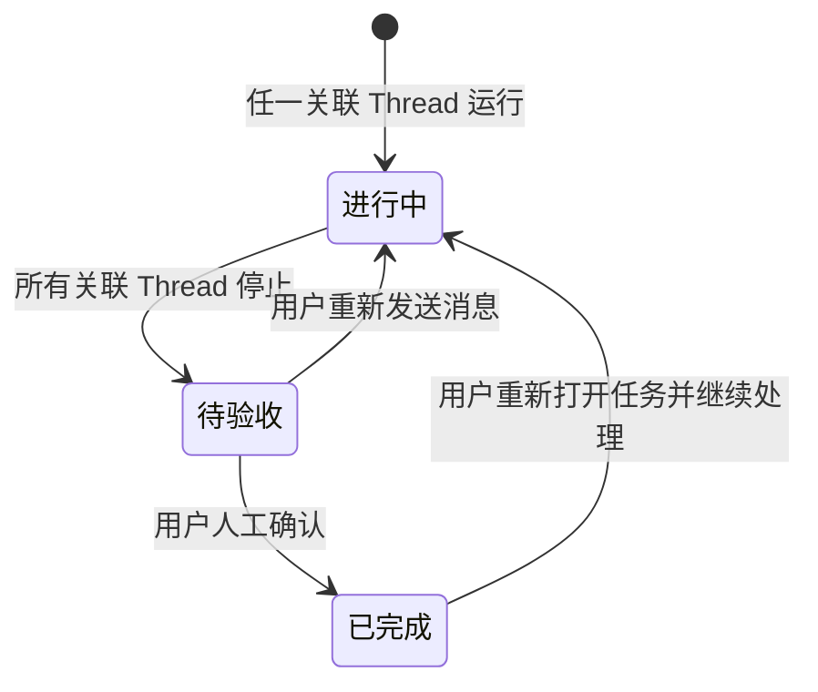

- `进行中`：至少一个关联 Thread 正在执行；
- `待验收`：所有关联 Thread 均已结束或停止；
- `已完成`：只能由用户确认；
- 用户在已完成 Task 中继续处理时，系统需明确提示并重新打开任务。

### 11.2 Thread 状态

Thread 只有：

- 运行中；
- 已结束。

Thread 状态不能直接等价为 Task 完成状态。

### 11.3 扫描状态

扫描状态不常驻主界面。只在以下情况出现轻量提示：

| 场景 | UI 反馈 |
|---|---|
| 新消息已产生、尚未抽取 | 顶部出现“正在更新任务…” |
| 抽取完成 | 静默刷新；若 Task 数变化则短暂提示 |
| 扫描失败但旧数据可用 | 非阻塞提示“任务信息可能不是最新” |
| 数据源不可读取 | 当前项目显示错误入口和重试按钮 |

---

## 12. 核心交互流程

### 12.1 从主对话查看 Task

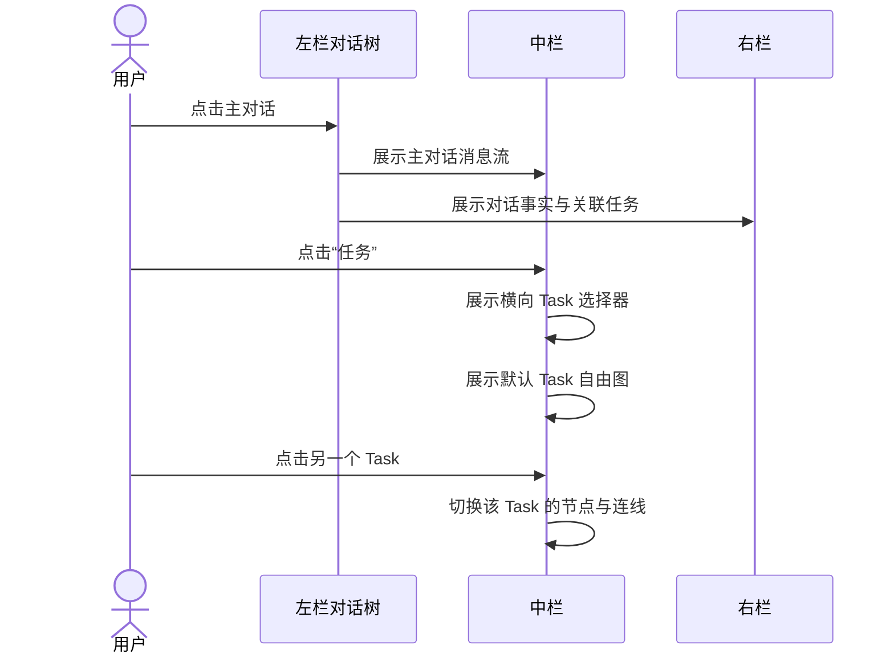

### 12.2 从 Task 节点回到线程继续处理

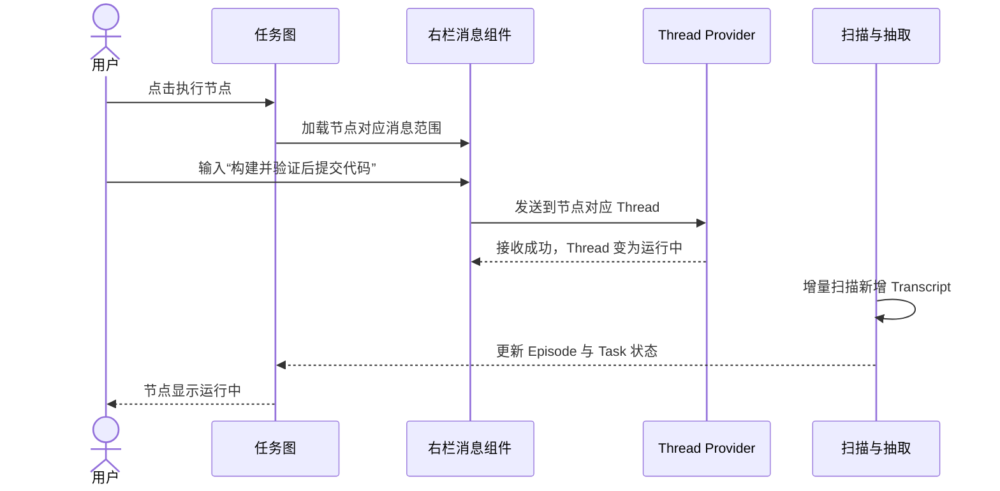

### 12.3 人工完成任务

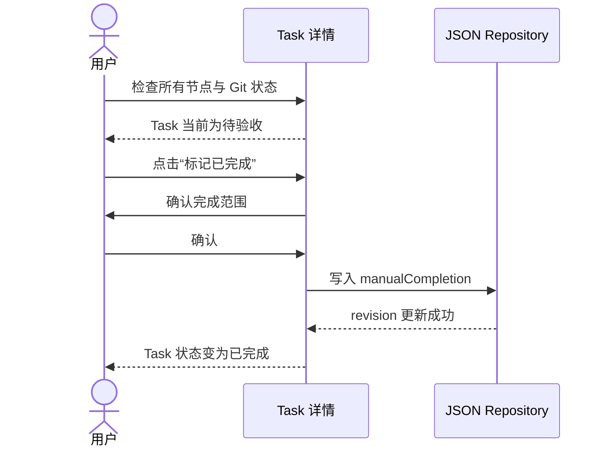

---

## 13. 数据到界面的映射

### 13.1 左栏主对话

| UI 字段 | 数据来源 |
|---|---|
| 标题 | `thread.title` |
| 主对话 | `thread.creationKind = human` |
| Task 数量 | `threadTaskIndex[threadId].taskIds.length` |
| 子对话 | `thread.parentThreadId` / lineage edge |
| 创建方式 | `thread.creationKind` |

### 13.2 Task 标题区

| UI 字段 | 数据来源 |
|---|---|
| Task 名称 | `task.title` |
| 摘要 | `task.summary` |
| 状态 | 运行状态聚合 + `manualCompletion` |
| 关联 Episode | `taskExecutionIndex[taskId]` |

### 13.3 节点

| UI 字段 | 数据来源 |
|---|---|
| 标题 | `episode.title` |
| 创建方式 | `thread.creationKind` |
| 运行状态 | `thread.runtimeStatus` |
| 时间 | `episode.startedAt` / `endedAt` |
| 工作模式 | `workspace.mode` |
| 工作区 | `workspace.path` |
| 分支 | `git.branch` |
| 提交状态 | `git.commitState` / `git.headCommit` |
| 同步状态 | `git.mainWorkspaceSyncState` |
| 原始消息 | `episode.messageRange` + Transcript projection |

未知值必须显示为 `未知`，不能由前端补猜。

---

## 14. 组件结构

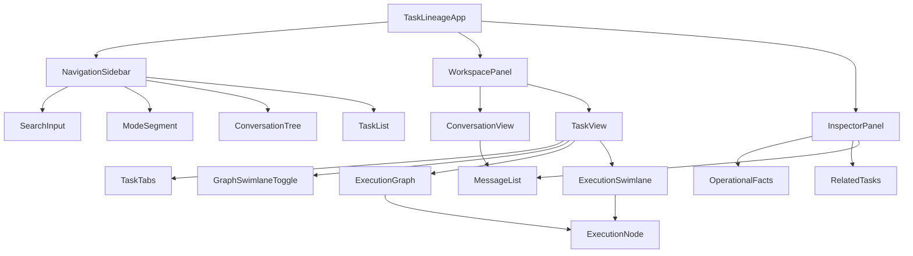

### 14.1 关键组件职责

| 组件 | 职责 |
|---|---|
| ConversationTree | 项目内主/子对话层级、展开和选择 |
| TaskTabs | 主对话内多个 Task 的横向切换 |
| ExecutionGraph | 自由拓扑、路径高亮、同线程联动 |
| ExecutionSwimlane | 按 Thread/时间组织同一份节点和边 |
| ExecutionNode | 展示 Episode 与 Git 事实 |
| MessageList | 中栏和右栏复用的消息阅读与发送 |
| OperationalFacts | 展示不经语义推断的工作区事实 |

Graph 和 Swimlane 必须消费同一个 `TaskFlowViewModel`，不可各自拼装业务数据。

---

## 15. 页面状态

### 15.1 首次加载

- 左栏先显示项目和对话骨架；
- 中栏显示当前选中对象骨架；
- 不使用全屏 Loading；
- JSON 索引可用后先展示缓存投影，再异步刷新 dirty Thread。

### 15.2 空状态

#### 没有主对话

文案：`还没有发现由你创建的对话`

辅助：`启动一次 Codex 或 Qoder 对话后，这里会自动建立索引。`

#### 主对话尚未抽取出 Task

对话消息仍正常展示。Task 视角显示：`正在从新增对话记录中识别任务`，并提供重新扫描。

#### Task 没有可绘制节点

显示 Task 标题和摘要，并提示：`已识别任务，但尚未关联到可展示的执行片段。`

### 15.3 错误状态

- 单个 Transcript 读取失败不阻塞其他对话；
- AI 抽取失败时保留上一个成功结果；
- JSON 写入失败时不可伪装成功，人工完成操作需回滚；
- Git 状态读取失败只将工作区事实标为未知，不影响消息查看；
- 错误详情进入诊断面板，主界面只展示可操作的简短提示。

### 15.4 数据更新

当用户正在 Hover 或选择节点时，后台刷新必须尽量保持：

- 当前 Task；
- 当前视图类型；
- 当前选中 Episode；
- 当前画布缩放和位置；
- 右栏草稿文本。

如果 Episode 因重新归类消失，右栏提示数据已更新，并选择最近的可追溯 Episode。

---

## 16. 键盘与无障碍

- `Tab` 可以遍历模式切换、对话项、Task 项、节点、发送区；
- `Enter/Space` 选择列表项和节点；
- 节点 Hover 能力必须有键盘 Focus 等价状态；
- `Esc` 关闭临时弹层或清除 Hover 预览，但不清除持久选择；
- 所有状态同时提供文本，不能只靠颜色；
- 图标按钮提供明确的 `aria-label`；
- 消息发送默认 `Enter`，换行使用 `Shift + Enter`；
- 图视角需要提供可访问的线性节点列表作为替代描述。

---

## 17. 响应式策略

该功能以桌面生产力场景为主。

| 宽度 | 行为 |
|---|---|
| ≥ 1180px | 完整三栏 |
| 900–1179px | 左栏缩到 220px，节点略缩窄，右栏 330px |
| < 900px | 左栏 + 中栏；右栏以覆盖式抽屉出现 |

暂不针对手机设计独立流程。图和泳道在小屏上保留缩放、平移，不强制压缩所有节点。

---

## 18. 文案规则

### 18.1 统一用词

| 概念 | 界面文案 |
|---|---|
| Human-created root thread | 主对话 |
| Forked thread | Fork |
| Agent-created standalone thread | 新对话 |
| Nested agent execution | Subagent |
| Task ready for human review | 待验收 |
| Changes integrated into main workspace | 已同步 |

### 18.2 禁止文案

没有原始证据时，不出现：

- 实现线程；
- 数据线程；
- 验证线程；
- 负责人；
- 任务派发；
- 验收未通过；
- 冲突风险；
- AI 判断已完成。

---

## 19. 验收标准

### 19.1 对话管理

- 第一层只显示人工创建的主对话；
- 主对话可展开派生线程；
- 子对话展示标题和创建方式；
- 选择任意对话默认展示它自己的消息；
- 只有主对话提供 Task 视角；
- 主对话 Task 数和横向 Task 选项数量一致。

### 19.2 Task 管理

- 支持自由图和时间泳道；
- 同一数据在两种视图间切换不丢失选择；
- 可以表达分叉、汇合和回流；
- Hover 高亮完整可达路径；
- 相同 Thread 的多个节点会被同时标记；
- 连线不展示推断语义；
- Task 只有进行中、待验收、已完成三态；
- 已完成只能由人工确认。

### 19.3 节点与 Git 状态

- 节点显示创建方式和 Thread 状态；
- 节点直接显示主工作区/独立 worktree；
- 节点直接显示提交状态；
- 节点直接显示是否同步到主工作区；
- 右栏显示工作区路径、分支和 Commit；
- 无法确认的信息显示未知。

### 19.4 消息与操作

- 中栏对话消息和右栏节点消息复用同一个组件；
- 点击节点可以查看对应消息范围；
- 可以向节点对应 Thread 继续发消息；
- 发送后运行状态能够更新；
- 后台增量扫描不会清除用户当前草稿。

---

## 20. 交付物

- 可交互原型：`prototypes/task-lineage-management/`
- 对话视角截图：`prototypes/task-lineage-management/qa/implementation-conversation.png`
- 自由图截图：`prototypes/task-lineage-management/qa/implementation-graph.png`
- 泳道图截图：`prototypes/task-lineage-management/qa/implementation-swimlane.png`
- 视觉检查记录：`prototypes/task-lineage-management/design-qa.md`
- UI 设计稿：`knowledge/20-product/task-lineage-management.md`
- 技术设计：`knowledge/10-architecture/task-lineage-and-extraction.md`

设计稿与技术方案的边界是：设计稿定义用户看到什么、如何操作和状态如何表达；技术方案定义 Transcript 如何扫描、Task 如何抽取、JSON 如何持久化以及状态如何计算。

---

## 21. 现状理解

当前 CodePet 生产界面使用 Svelte，已经能够消费 Provider、Conversation 和 Turn 状态，但尚未实现 Task、Execution Episode 和跨 Thread 谱系。本文中的交互证据来自 `prototypes/task-lineage-management/` 的独立 React 原型；它验证信息架构和行为，不代表生产前端已经接入。

## 22. 涉及模块

- `frontend/`：未来生产 UI、路由、状态管理和复用消息组件的落点。
- `frontend/lib/runtimeGateway.ts`：现有对话读取和创建能力入口，后续需要接入任务谱系查询。
- `protocol/provider/`：决定“打开原始对话”和“继续发送消息”在不同 Provider 上是否可用。
- `src-tauri/src/`：为界面提供任务查询、人工完成和 Git 状态 command。
- `prototypes/task-lineage-management/`：本设计稿的视觉和交互证据。

## 23. 风险与验证

- 三栏在较窄桌面上拥挤：在 1440×1024、1180px 和 900px 临界宽度做人工布局检查。
- 图节点信息过密：验证标题、创建方式、运行、工作模式、提交和同步状态在自由图及泳道中都不截断关键事实。
- Task 抽取变化导致当前选择跳动：使用稳定 Task/Episode ID 做状态保持测试。
- Hover 改变右栏会打断输入：Hover 只影响路径和同线程标记，右栏仅由点击选择驱动。
- Provider 不支持继续已有会话：依据 capability 隐藏发送框并展示明确原因，不提供无效操作。
- 状态颜色混淆：所有颜色都必须同时配套文字，并完成键盘 Focus 和可访问名称检查。

## 24. 测试计划

- 运行原型 `npm run build` 和 `npm run test:sites`。
- 回归主对话展开、派生对话选择、主对话对话/任务切换和横向 Task 数量一致性。
- 回归自由图/泳道切换、节点选择保持、完整路径高亮和同 Thread 联动。
- 回归中栏与右栏消息组件的发送、发送中、失败和草稿保持。
- 回归 Task 三态、Thread 两态、人工完成以及重新打开任务。
- 使用键盘完成核心导航并检查图的线性替代描述。

## 25. 知识沉淀

本文是任务谱系管理的产品行为基线。实现完成后，应将原型中的模拟状态替换为生产截图，并把已经落地的行为与仍是规划的行为明确分开；可复用的 UI 状态约束应提升到 `knowledge/60-rules/`。

## 26. 未知项

- 生产界面最终作为现有主窗口页面、独立窗口还是新的应用入口，尚未确认。
- Task 模式左栏在跨项目场景下的筛选和排序规则尚未确认。
- 超大任务图的折叠、聚类和虚拟化阈值尚未通过真实数据验证。
- 人工标记已完成是否需要二次确认，以及重新打开已完成 Task 的产品文案尚未确认。
